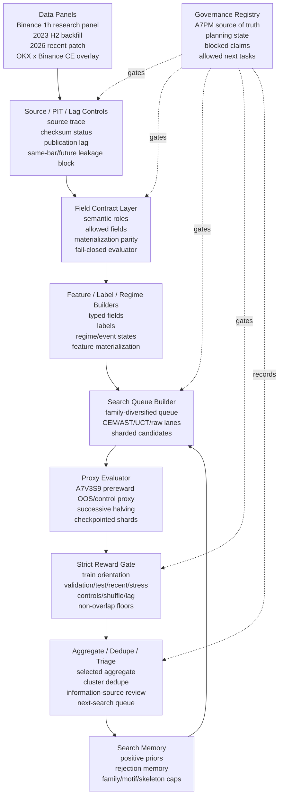

# Current Architecture

Generated: 2026-07-05

## Scope

This is the curated current architecture of the crypto AlphaFactory research/search stack. It intentionally excludes historical stage scripts, superseded reports, raw runtime files, and one-off diagnostics unless they still define an active contract.

This is not alpha proof and not deployment authorization.

## Architecture Diagram



## Active Component Contracts

| Component | Current role | Current evidence |
|---|---|---|
| Data panels | Provide controlled research data at 1h primary horizon, with 1m/15m available but not yet primary search stack | `.planning/PROJECT.md`, `.planning/STATE.md` |
| Source/PIT controls | Block same-bar/future leakage and record source-lag/checksum status | `CRYPTO_A7LIVE1_SOURCE_LAG_CHECKSUM_AUDIT_20260704.md`, A7SOURCE reports |
| Field contracts | Enforce field role, materialization, evaluator parity, and fail-closed behavior | A7AI-F0/F1/F2/F3/F4 |
| Feature/label/regime builders | Convert data fields into typed features, labels, and state variables | A7AA, A7FF, A7FFCORE reports |
| Search memory | Feed prior positives and rejections into next queue construction | A7MEM records and current planning state |
| Queue builder | Produce bounded, family-diversified, sharded search queues | `CRYPTO_A7SEARCH7_FAMILY_DIVERSIFIED_QUEUE_20260704.md` |
| Proxy evaluator | Score broad candidates cheaply before strict reward | A7V3S9 prereward proxy stack |
| Strict reward | Reject headline-metric artifacts with train/OOS/stress/control gates | A7REWARD reports |
| Aggregate/dedupe/triage | Convert shard outputs into non-duplicate review packets and next-search inputs | A7SEARCH aggregate scripts and reports |
| Governance | Decide what is current, superseded, blocked, or authorized | A7PM registry and planning files |

## Active Runtime Flow

```text
source-audited data
-> field contract enforcement
-> feature/label/regime construction
-> memory-aware search queue
-> sharded proxy evaluation
-> strict reward gate
-> aggregate and dedupe
-> memory update / next queue
```

## Current Search State

The active large task is A7SEARCH7 R2 on the company machine:

```text
run root:
  D:\HermesWorker\runtime\a7search7_family_diversified_proxy_65k_r2_20260704

scope:
  65,536 queue rows
  128 shards x 512 rows
  proxy search only
```

This search does not authorize alpha proof, shadow, paper, live, or production portfolio construction.

## Non-Architecture Files

The repository contains many historical stage scripts and reports. They are valuable evidence, but they are not all active architecture. Treat them as evolution records unless A7PM/current planning state marks them current.
