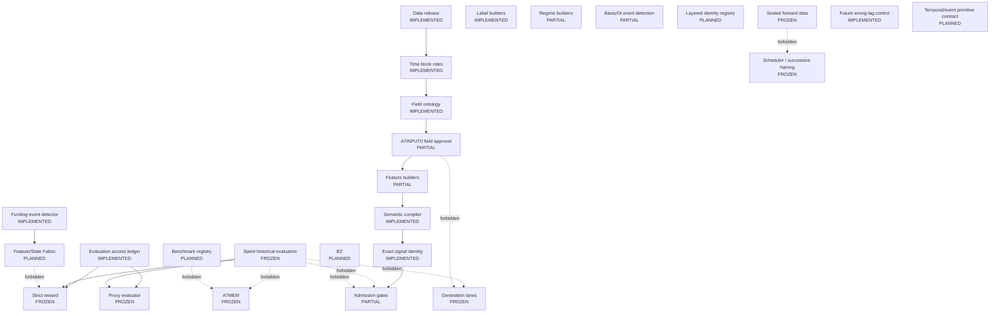

# Current Architecture

Generated from `config/crypto_architecture_control_registry_v1.json`. Registry SHA256: `87F7EFEEA56D7A0BD7A7552F95821F3BF4D91BD407D794758064111C595F7E4D`.

Status: `PHASE_A_GOVERNANCE_ACCEPTED` / `SEARCH_COLLAPSE_SOURCE_PARTIALLY_IDENTIFIED` / `HOLD_RESEARCH`.

Raw graphify is unavailable in this environment; `graph.json` retains the prior navigation graph plus a deterministic `control_*` architecture overlay. This curated document is the current architecture authority.

## Architecture

## Node Registry

| Node | Status | Implementation | Entrypoint | Input -> Output | Data role | Feedback | Artifact/test | Last verified SHA | Blocker |
|---|---|---|---|---|---|---|---|---|---|
| Data release | IMPLEMENTED | runtime/a7eff2_git_release_20260711/a7eff2_release_manifest.json | a7eff2_release_manifest.json | immutable released artifacts -> hash-addressed release evidence | historical release evidence | AUDIT_ONLY | runtime/a7evalreset0_evaluation_governance_20260711/a7evalreset0_release_integrity_audit.csv | 1D5B5C5D498F65DE0DAC360A4604036F654119666DCEF32E256501B65C2A9D60 | source arrays absent locally |
| Time block roles | IMPLEMENTED | config/crypto_evaluation_access_policy_v1.json | epoch_access | epoch id -> discovery/spent/sealed role | evaluation governance | TRAIN_OR_INNER_VALIDATION_ONLY | tests/test_evaluation_access.py | 57B23A06C28A64F230C39B82D39E4631B7D195898B686E27B869233EDB728FBC | none |
| Field ontology | IMPLEMENTED | runtime/a7ffr1_field_ontology_v3/a7ffr1_field_ontology_v3.csv | a7ffr1_field_ontology_v3.csv | source and derived fields -> semantic/value-domain roles | field semantics | NO_DIRECT_FEEDBACK | runtime/a7eff2_git_release_20260711/a7eff2_active_field_registry.csv | 6087848CEA8B417D33446C759D8CBC7B78925617E048A3DC8D25D0C1CEE1205E | ontology is broader than approved inputs |
| A7INPUT0 field approval | PARTIAL | runtime/a7input0_input_approval_package/a7input0_input_approval_registry.csv | a7input0_input_approval_registry.csv | field ontology -> approved input roles | input authorization | NO_OOS_DERIVATION | runtime/a7evalreset0_evaluation_governance_20260711/a7evalreset0_risk_closure_audit.csv | 25CD1161A174BAFA5F0BE631FE05EA971181D2EB42D1D452F798C4BFE649E60F | 6 of 10 active fields unapproved; v2 roles pending |
| Feature builders | PARTIAL | scripts/crypto_a7ak_lv1_latent_state_feature_build.py | feature build scripts | approved observable fields -> historical features | feature construction | NO_NEW_GENERATOR_FIELDS_B0 | runtime/a7al0r_code_feature_regime_readiness_audit/a7al0r_feature_lineage_ledger.csv | 60B7FC55A963B16D6D877D9E0B88C450694CA5F414C84EFE2CDCB220D8C0B493 | Feature/State Fabric contract pending |
| Label builders | IMPLEMENTED | scripts/crypto_a7aa1_primitive_response_map.py | horizon_label | PIT prices and horizons -> research labels | label only | SPENT_EPOCH_REPORT_ONLY | scripts/crypto_a7al2x5_evaluator_preflight_smoke.py | 278CDCF482AF999B93946C24123877CD919E6AEB7F804F9C051394297A8FB922 | no untouched final OOS |
| Regime builders | PARTIAL | scripts/crypto_a7al0g_upper_regime_state_builder.py | regime builder scripts | historical features -> regime/state observations | state and audit | FROZEN_FROM_REWARD_UNTIL_B1 | runtime/a7al0g_upper_regime_state_builder/a7al0g_regime_state_contract.csv | 92AE2B97BB46B86A2C2525BF66F6E0A7B92BD276E42138964930774D05EA6288 | reusable State object not established |
| Funding event detector | IMPLEMENTED | alphafactory_crypto/funding_events.py; config/crypto_funding_event_contract_v1.json; scripts/crypto_b0_funding_event_audit.py | canonicalize_funding_events | native funding settlement records -> canonical payment events and audit | event observation | AUDIT_ONLY_B0 | tests/test_funding_events.py; runtime/a7b0_funding_event_contract_20260711/funding_event_audit_summary.json; reports/CRYPTO_B0_FUNDING_EVENT_CONTRACT_20260711.md | 11D6EC1952E4A0EE8CEC9C970F3E3C78DEF90602500A0F26D547FCDA63996B3F | production recall remains unmeasured without approved truth set |
| Basis/OI event detection | PARTIAL | scripts/crypto_a7regime2_mechanism_regime_audit.py | mechanism regime audit | basis and OI observations -> historical mechanism states | event/state audit | FROZEN_FROM_REWARD_UNTIL_B1 | runtime/a7regime2_mechanism_regime_audit_20260612/a7regime2_hourly_mechanism_state_panel.csv | CB1EDDE3AA987D74C4478A141D2A775076EC8F01E71B66588A0FF76307A4AAA5 | temporal/event primitive contract pending |
| Semantic compiler | IMPLEMENTED | alphafactory_crypto/engines/semantic_domains.py | semantic canonicalization | typed AST and field domains -> canonical expression | semantic identity | NO_METRIC_FEEDBACK | docs/adr/0001-controlled-semantic-identity-and-safediv-gates.md | 8673D940C00111D362E55FE1A70B5F52F77D2BA9FA37882221C8CBE0166F2AC3 | none |
| Exact signal identity | IMPLEMENTED | alphafactory_crypto/engines/signal_identity.py | signal fingerprint | materialized signal weights -> representative and aliases | exact numeric identity | REPORT_ONLY_DURING_HOLD | runtime/a7eff2_git_release_20260711/a7eff2_accepted_train_validation_oos_log.csv | FCA93D783E1F0950C899906D810509DA637FD81A8059A9DF3C6DBB2D74B02DF8 | activation and PnL layers pending |
| Layered identity registry | PLANNED | planned | planned | syntax through economic hypothesis -> six-layer identities and mappings | identity governance | NO_PROMOTION_B0 | planned | D030676B9B64F6ACA0BA6B7D37DA221946417F6692C488DDEB3B72E0895A7743 | B0.5 pending |
| Generation lanes | FROZEN | scripts/crypto_a7ls1_multi_arm_blueprint_generation.py | generation scripts | approved fields and primitives -> candidate queues | candidate generation | NO_RUN_B0 | verified_core_crypto_20260618/holds/CEM_AST_SEARCH_CORE_HOLD.md | 08493D1801C8D733E3EE1F8B7F755259D4B6CE0D599985DC51B70E046CC051BC | search revoked; A7INPUT0-v2 pending |
| Proxy evaluator | FROZEN | scripts/crypto_a7v3s9_prereward_oos_control_proxy.py | proxy main | candidate queue and spent historical metrics -> report-only diagnostics | historical evaluation | NO_CANDIDATE_FEEDBACK | tests/test_evaluation_access.py | 227162B70E5897768F07D9E7A7E5C7A7E1FB0EAA81AA0BC4552D210694581128 | spent OOS contamination |
| Strict reward | FROZEN | scripts/crypto_a7reward1_portfolio_reward_model.py | aggregate_rewards | signals and historical splits -> report-only reward audit | historical evaluation | NO_CANDIDATE_FEEDBACK | tests/test_evaluation_access.py; tests/test_future_wrong_lag.py | 1A1293EF5304B9772109A854F65D7E505653B22E901F024A51B1325ED2DA95CC | spent OOS; production negative control not executed during HOLD_RESEARCH |
| Admission gates | PARTIAL | scripts/crypto_a7source5_a7search7_source_lag_reward_flow.py | semantic/source-lag/identity gates | candidate rows -> survivors and aliases | candidate admission | REPORT_ONLY_B0 | runtime/a7evalreset0_evaluation_governance_20260711/a7evalreset0_collapse_stage_audit.csv | 9E4B859D56B665BADB4A6F579CAF31BEAA107A3E45CE70685911F740858A69F1 | independent-information collapse not localized |
| A7MEM | FROZEN | scripts/crypto_a7mem0_search_memory_registry.py | memory registry main | candidate feedback -> search priors | search memory | NO_POSITIVE_OR_NEGATIVE_UPDATE_B0 | tests/test_evaluation_access.py | 7EC9C27A3FDD1AE8D5CCB6D674B2DBD092704CECB22593C3E228AFAAD3988717 | all current candidate feedback is spent/OOS-derived |
| Scheduler / successive halving | FROZEN | scripts/crypto_a7source10_proxy_reward_flow_company_py_20260708.py | scheduler main | proxy/reward queues -> budgets and shards | compute allocation | NO_ADAPTIVE_OOS_FEEDBACK | tests/test_evaluation_access.py | AEA93934C17B10B0AC4EA5F833DFC807281F322DD481A3A8C39DCE1637FE53E6 | spent evaluation budget contamination |
| Benchmark registry | PLANNED | planned | planned | benchmark definitions -> versioned benchmark observations | comparison only | NO_POSITIVE_MEMORY | planned | 540C4BDF71F184F6E0D0D60AF7995700A9AD21F93C71533BB4DA71308B6BB97B | B0.6 pending |
| Evaluation access ledger | IMPLEMENTED | alphafactory_crypto/evaluation_access.py | assert_candidate_feedback_columns_allowed | epoch and metric access -> allow/block decision | evaluation governance | FAIL_CLOSED | runtime/a7evalreset0_evaluation_governance_20260711/a7evalreset0_evaluation_access_ledger.csv; tests/test_evaluation_access.py | 25D58EBAFB84B933E27AAEE25DB3BBD5C709440608E686BF3B7D76CA234BF76C | none |
| Spent historical evaluation | FROZEN | runtime/a7evalreset0_evaluation_governance_20260711/a7evalreset0_oos_burn_ledger.csv | OOS burn ledger | validation/test/recent/May -> spent classification | historical report only | DENY_CANDIDATE_FEEDBACK | tests/test_evaluation_access.py | CE9A5FE5B41F5858F65B8A1058C44E9C1D3572398A3080CBD32BC48D044F975A | irreversible exposure |
| Sealed forward data | FROZEN | config/crypto_evaluation_access_policy_v1.json | unknown epoch default | unseen epoch -> SEALED_FORWARD | sealed evaluation | NO_READ_B0 | tests/test_evaluation_access.py | 57B23A06C28A64F230C39B82D39E4631B7D195898B686E27B869233EDB728FBC | requires explicit future authorization |
| Future wrong-lag control | IMPLEMENTED | alphafactory_crypto/negative_controls.py; config/crypto_future_wrong_lag_control_v1.json; scripts/crypto_b0_future_wrong_lag_audit.py; scripts/crypto_a7reward1_portfolio_reward_model.py | future_wrong_lag / audit_future_wrong_lag | signal and future shifts -> negative-control metrics | leakage control | AUDIT_ONLY_B0 | tests/test_future_wrong_lag.py; runtime/a7b0_future_wrong_lag_control_20260711/future_wrong_lag_audit_summary.json; reports/CRYPTO_B0_FUTURE_WRONG_LAG_CONTROL_20260711.md | 8C10045585A87B577A001D07341FA1B8E06F9C14B5AA681471B760B1D54D4347 | production execution frozen during HOLD_RESEARCH |
| BZ | PLANNED | planned | undefined | undefined -> undefined | unresolved | DENY_ALL_PROMOTION | planned | F88927E4C3AE78ACA13B5CB186582FF768F6CF8B89346096C28CC9A00AF10DBF | no authoritative definition or implementation |
| Temporal/event primitive contract | PLANNED | planned | planned | observable event streams -> PIT temporal primitives | temporal semantics | NO_REWARD_B0 | planned | 53DCEC71204C1790DD7EDC180AB6BE3C2AB79E4CE84450DC6143E37D9B228758 | B0.7 pending |
| Feature/State Fabric | PLANNED | planned | planned | approved observations and contracts -> deterministic feature/state cache | feature/state materialization | NO_REWARD_B0 | planned | 635836D46E1ECFCEC7CF9CC3B754E16325FDC5FCB52563261DA4DFA10B651A0B | B0.8 pending |

## Time Block Roles

- 2024 train: discovery training, not OOS proof.
- 2025-06 validation, 2025-12 test, 2026-04 recent, and 2026-05 stress: `SPENT_HISTORICAL_EVALUATION`, report-only.
- Unknown/new epochs: `SEALED_FORWARD`, no read in B0.

## Forbidden Edges

| Source | Target | Prohibition |
|---|---|---|
| spent_evaluation | admission | no candidate ranking |
| spent_evaluation | generation_lanes | no CEM/UCB/MCTS feedback |
| spent_evaluation | a7mem | no memory update |
| sealed_forward | scheduler | no forward OOS scheduling |
| benchmark_registry | a7mem | no benchmark positive memory |
| feature_state_fabric | strict_reward | State/event reward edge frozen until B1 |
| a7input0 | generation_lanes | unapproved fields cannot enter primary generator |
| bz | admission | undefined BZ cannot promote |
