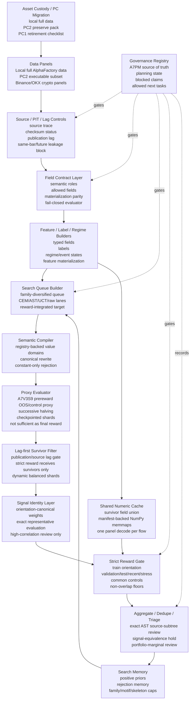

# Current Architecture

Generated: 2026-07-11

## Scope

This is the curated current architecture of the crypto AlphaFactory research/search stack. It intentionally excludes historical stage scripts, superseded reports, raw runtime files, and one-off diagnostics unless they still define an active contract.

This is not alpha proof and not deployment authorization.

## Architecture Diagram



## Active Component Contracts

| Component | Current role | Current evidence |
|---|---|---|
| Data panels | Provide controlled research data at 1h primary horizon, with 1m/15m available but not yet primary search stack | `.planning/PROJECT.md`, `.planning/STATE.md` |
| Asset custody | Keep useful crypto assets off the retiring PC1 and prove migration with hashes/manifests before deletion | PC1 preserve pack hash `715F0A23E9AAB23794ED870A14AC5E0B35ED40C45AD15010A8FFE3245A383D07`, PC2 inventory, local `G:\AlphaFactory_CryptoData` |
| Source/PIT controls | Block same-bar/future leakage and record source-lag/checksum status | `CRYPTO_A7LIVE1_SOURCE_LAG_CHECKSUM_AUDIT_20260704.md`, A7SOURCE reports |
| Field contracts | Enforce field role, materialization, evaluator parity, and fail-closed behavior | A7AI-F0/F1/F2/F3/F4 |
| Feature/label/regime builders | Convert data fields into typed features, labels, and state variables | A7AA, A7FF, A7FFCORE reports |
| Search memory | Feed prior positives and rejections into next queue construction | A7MEM records and current planning state |
| Queue builder | Produce bounded, family-diversified, sharded search queues; current next version should be reward-integrated/source-lag-aware rather than proxy-only | A7SEARCH/A7SOURCE planning state |
| Semantic compiler | Propagate contracted field value domains through ASTs, rewrite nonconstant identities, and reject constant-only collapse before expensive numeric work | ADR 0001, `semantic_domains.py`, `crypto_field_value_domain_rules_v1.json` |
| Proxy evaluator | Score broad candidates cheaply before strict reward; proxy outputs require fresh source-lag proof and strict reward before promotion | A7V3S9 prereward proxy stack, PC2 source-lag/reward rerun |
| Strict reward | Reject headline-metric artifacts with train/OOS/stress/control/source-lag gates; use common random controls, prepared rank/weight reuse, and a shared numeric memmap cache | `CRYPTO_A7EFF1_SEARCH_REWARD_EFFICIENCY_AUDIT_20260710.md`, A7REWARD reports |
| Signal identity | Evaluate one representative per exact portfolio-weight identity, restore aliases before policy gates, and keep high-similarity non-exact signals reviewable | `signal_identity.py`, A7EFF2 PC2 evidence |
| Aggregate/dedupe/triage | Restore aliases for lineage/source policy, emit representative-only memory feedback, compare exact AST subtrees, and route unstable SafeDiv/marginal trade-offs to review | A7SOURCE6 outputs and `CRYPTO_A7EFF2_SEMANTIC_IDENTITY_SAFEDIV_INTEGRATION_20260710.md` |
| Governance | Decide what is current, superseded, blocked, or authorized | A7PM registry and planning files |

## Active Runtime Flow

```text
source-audited data
-> field contract enforcement
-> feature/label/regime construction
-> memory-aware search queue
-> semantic canonicalization / constant-only rejection
-> sharded proxy evaluation
-> source-lag survivor filter
-> exact portfolio-signal representative selection
-> shared numeric cache
-> strict reward gate
-> alias restoration / representative-only memory feedback
-> exact source-subtree / SafeDiv / marginal triage
-> memory update / next queue
```

## Current Evaluated Data Split

The A7EFF2 frozen regression used the following actual PC2 shared-cache windows, not the full nominal validation/OOS contracts:

| Role | Actual selected UTC window | Hours | Policy |
|---|---|---:|---|
| Train/orientation | 2024-01-01 00:00 to 2024-12-31 23:00 | 8784 | Full available 2024 split |
| Validation OOS | 2025-06-01 00:00 to 2025-06-30 23:00 | 720 | Last 720 hours of 2025H1 |
| Historical test OOS | 2025-12-02 00:00 to 2025-12-31 23:00 | 720 | Last 720 hours of 2025H2 |
| Recent OOS | 2026-04-01 00:00 to 2026-04-30 23:00 | 720 | Last 720 hours of Jan-Apr contract |
| Known stress veto | 2026-05-01 00:00 to 2026-05-26 00:00 | 601 | All available May stress hours |

The delivered 2023H2 backfill exists in data custody but was **not** materialized into this A7EFF2 replay panel or numeric cache. Therefore A7EFF2 does not prove robustness on 2023H2. The machine-readable evidence is under `runtime/a7eff2_git_release_20260711/`.

## Current Search State

No active process is authorized to produce alpha-ready candidates. The PC2 reward-integrated incremental-validation flow is complete.

```text
focused exact-subtree validation:
  source_blueprints: 8
  queue_rows: 53
  semantic_canonical_rewrites: 8
  semantic_constant_rejects: 3
  source_lag_survivors: 33
  exact_signal_representatives: 18
  exact_alias_evaluations_avoided: 15
  reward_rows: 132
  accepted_rows: 16
  reward_representative_triage_rows: 6
  final_incremental_memory_feedback_rows: 1
  memory_credit_release_status: HOLD_A7INPUT0_COVERAGE_GAP
  eval_error_rows: 0
  incremental_interactions: 1
  oos_equivalent_nonunique: 5
  canonical_repass_failures: 1
  portfolio_marginal_reviews: 1

SafeDiv review:
  denominator_q01_to_median: 0.020154
  signal_abs_p99_to_median: 462.110403
  top_1pct_abs_signal_mass_share: 0.743924
  decision: HOLD_PORTFOLIO_MARGINAL_REVIEW

efficiency verification:
  baseline_total_seconds: about 1735
  optimized_v2_total_seconds: 136.688
  total_speedup: about 12.7x
  accepted_set_match: exact 16/16
  gate_and_reject_match: exact
```

The next architecture objective is to close A7INPUT0 coverage for the final formula's two inputs, then apply cluster-aware marginal credit and representative-only A7MEM/CEM/UCB feedback. Typed State/subgraph governance exists, but reusable State materialization is not yet active in the main search/reward loop. A proxy-only expansion remains diagnostic and must not be used as the source of accepted alpha candidates.

## Asset Custody State

PC1 is being retired. Useful crypto assets must not remain solely on PC1.

```text
PC1 preserve pack:
  local path:
    G:\Chengbo\runtime\pc1_crypto_preserve_pack_20260709_results\pc1_crypto_preserve_pack_20260709.tar
  PC2 path:
    D:\HermesWorker\runtime\crypto_line\pc1_crypto_preserve_pack_20260709\pc1_crypto_preserve_pack_20260709.tar
  SHA256:
    715F0A23E9AAB23794ED870A14AC5E0B35ED40C45AD15010A8FFE3245A383D07

PC1 still contains:
  D:\HermesWorker\GDrive\Project_V7_Rotation\alpha_pit_engine_crypto_20260519_remote (~1.04GB)
  D:\HermesWorker\GDrive\AlphaFactory_CryptoData (~94.85GB)
  D:\HermesWorker\runtime crypto/search outputs

Verified non-PC1 custody:
  local full data:
    G:\AlphaFactory_CryptoData (~102.51GB)
  PC2 executable subset:
    D:\HermesWorker\data\crypto_line\AlphaFactory_CryptoData (~36.97GB)
  PC2 runtime/search/reward/preserve roots:
    D:\HermesWorker\runtime\crypto_line
```

Deletion of PC1 assets is a separate destructive step. Before deleting, run a final inventory and compare against local/PC2 custody; do not infer deletion readiness from graph files alone.

## Non-Architecture Files

The repository contains many historical stage scripts and reports. They are valuable evidence, but they are not all active architecture. Treat them as evolution records unless A7PM/current planning state marks them current.

Use `ARTIFACT_LIFECYCLE.md` to classify process artifacts after milestones. Do not promote fast-iteration runtime outputs, superseded diagnostics, or temp/debug files into the active architecture.
