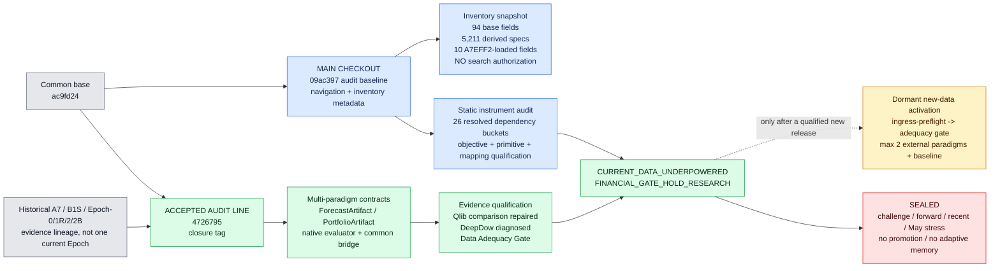

# Crypto Current Architecture

Updated: 2026-07-14 Asia/Hong_Kong

## Scope and authority

This file is the small, human-maintained view of the currently accepted Crypto architecture and evidence boundaries. It is deliberately branch-aware.

- **RAW**: `.planning/graphs/graph.json`, `GRAPH_REPORT.md`, and optional `graph.html` are generated from the checked-out `main` tree. They are code-navigation aids only.
- **CURRENT**: this file records the accepted architecture and decision state. It is not generated from RAW and is not runtime proof.
- **History**: Git commits, tags, manifests, reports, and runtime artifacts remain immutable evidence. Supersession changes their interpretation, not their contents.

There is no architecture registry in the audited `main@09ac397c61b0b462497e9a8c0ea84981cc6a93f9` baseline. The existing `crypto_architecture_control_registry_v1.json` and frontier execution stack live on the accepted audit closure line. They are not copied into `main` merely to make a diagram. No second registry, `current.json`, declared/static/observed graph set, runtime-trace framework, or edge-level Graph gate is authorized.

## Branch-aware architecture map



Colors supplement the text labels; they do not carry meaning by themselves. Blue is the checked-out `main` baseline, green is accepted evidence on the closure line, yellow is dormant and conditional, red is sealed, and gray is historical lineage.

## Repository HEAD reality

`main@09ac397` is the baseline for the 2026-07-14 independent audit. It contains the static runtime inventory, lightweight RAW Graph maintenance, and earlier A7 code/history. The inventory is metadata and lineage evidence only:

- 94 aggTrades base-registry rows and 5,211 derived specs were recovered from historical commit `1ed5acd`;
- ten fields are verified as loaded by the A7EFF2 release entrypoint;
- the inventory does not authorize search, replay, alpha proof, forward use, or a claim that A7EFF2 is the whole program's current Epoch;
- frontier Arena, Qlib/DeepDow qualification, Data Adequacy Gate, and direct new-data activation code are not executable from this `main` checkout.

The phrase “current Epoch” in `reports/CRYPTO_FEATURE_RUNTIME_INVENTORY_20260714.md` is therefore local to that inventory: it means the latest verifiable A7 release represented by that package. It must not collapse B1S, Epoch-0, Epoch-1R, Epoch-2, Epoch-2B, and Frontier into A7EFF2.

## Latest independent instrument audit

The static audit rooted at `main@09ac397` and the accepted closure source confirms `CRYPTO_SEARCH_INSTRUMENT_MISMATCH_CONFIRMED` within a bounded scope:

- the 5,211 A7V1 rows are registered specs, not 5,211 materialized independent signals; independent information-axis count is not statically identifiable, while the deterministic taxonomy finds 26 formula-resolved canonical dependency buckets and 29 unresolved sets;
- B1S and Epoch-0 adapt on a zero-cost gross proxy that omits material strict-evaluator axes;
- Epoch-1 materially repaired feedback with cost, benchmark increment, stability, turnover, and concentration, while Epoch-1R changed admission rather than that feedback; strict-only IC, placebo, and Pareto axes remain outside the adaptive scalar;
- Epoch-2 tests blocker-local repair actions, not unrestricted mechanism discovery; its recorded LLM repair is deterministic typed repair with no model call;
- multiple temporal primitives drift or collapse into code aliases across implementations;
- rank mapping demonstrably removes common-mode and confidence information and can create reranking turnover, but its historical causal share of turnover is not identified.

These facts qualify the research instrument. They do not establish that the market has no alpha, that the mechanism space is exhausted, or that new data is the unique next step. The economic gate remains `HOLD_RESEARCH`; no repair or search is automatically authorized by this audit.

## Accepted project evidence

The accepted project evidence is anchored at:

```text
branch: origin/audit/evalreset-collapse-forensics-20260711
commit: 4726795f61052470d56e2d1475e4f6da9d262943
tag:    crypto-frontier-provenance-closure-20260714
```

That closure proves the following within its stated development-only scope:

| Capability or result | Qualified status | Evidence identity |
|---|---|---|
| Adapter-neutral forecast and direct-portfolio artifacts | `ACCEPTED_DEVELOPMENT_ONLY` | `runtime/crypto_frontier_research_v2_20260713/architecture_decision.json` on the closure tag |
| Native Qlib v0.9.7 reproduction | Reproduced; original full/control fit was degenerate | closure-tagged Qlib reproduction and qualification assets |
| Native DeepDow v0.2.3 reproduction | Reproduced; comparison, fit, and mapping are not exactly degenerate | closure-tagged DeepDow reproduction and qualification assets |
| Common development bridge | One-day delayed weights with 5 bps L1-turnover cost | corrected Arena evidence on the closure tag |
| Qlib repair | `EXTERNAL_PARADIGM_COMPARISON_DEGENERATE_FIXED` | full/control predictions and weights differ after one frozen non-search repair |
| Qlib economic qualification | `DATA_ADEQUACY_UNDERPOWERED` | 23 development dates; LCB crosses zero |
| DeepDow economic qualification | `DATA_ADEQUACY_UNDERPOWERED` | only five independent five-day development blocks |
| Data Adequacy Gate | Implemented on closure line | predeclared minimum dates, samples, assets, history, label, turnover, and independent blocks |
| New-data activation | Implemented on closure line, dormant | content-hash-bound ingress facts; no large run unless adequacy passes |

The machine-readable closure manifest reports `REPOSITORY_PROVENANCE_CLOSURE_COMPLETED`. The annotated tag records `Final Reproducer: PASS`, `Final Gatekeeper: PASS`, base bundle SHA256 `99C0DACAF12F17DA6B7705DDBFCE9BAD996143082301F47BCA7E690071140EF2`, `CURRENT_DATA_UNDERPOWERED`, and `HOLD_RESEARCH`.

The user-accepted project interpretation, which governs subsequent work, is:

```text
CRYPTO_FRONTIER_PROVENANCE_CLOSURE_ACCEPTED
CURRENT_DATA_UNDERPOWERED
FINANCIAL_GATE_HOLD_RESEARCH
```

This does **not** establish that data is the unique bottleneck, that Qlib or DeepDow is economically ineffective, that an external component has a development increment, that any system is OOS robust, or that a candidate is promotion-eligible.

## Accepted causal chain

```text
qualified data release
-> paradigm-native representation and target/horizon
-> native learner or direct allocation model
-> ForecastArtifact or PortfolioArtifact
-> native evaluator
-> explicit delayed common bridge
-> actual weight-change turnover and costs
-> Data Adequacy Gate
-> development evidence qualification
-> OOS proof (absent and sealed)
```

The key architecture advance is the ability to carry both forecast-first and portfolio-first paradigms without forcing both through the old single formula-score mapping. Native and bridge evaluators remain separate.

## Superseded current-state claims

The following old planning claims are no longer current instructions:

- “close A7INPUT0 coverage, update A7MEM/CEM/UCB, then run a broader reward-integrated search”;
- “A7EFF2 is the current Crypto Epoch” outside the inventory's narrow release meaning;
- “Qlib full vs control 0/0 means Alpha158 has no increment”;
- “DeepDow is an informative negative”;
- any implication that existing positive historical metrics reopen challenge, forward, recent, May stress, promotion, or adaptive cross-sprint memory.

Historical files remain in Git as evidence. This document supersedes only their use as the current action plan.

## Frozen boundaries

```text
NEW_PERFORMANCE_SEARCH_FROZEN
FORWARD_SEALED
CHALLENGE_SEALED
RECENT_SEALED
MAY_STRESS_SEALED
NO_CANDIDATE_PROMOTION
NO_CROSS_SPRINT_ADAPTIVE_MEMORY
NO_NEW_DATA_INTEGRATION
```

A genuinely new, independently delivered release remains one conditional future route, not a proven unique remedy. If later authorized on the closure line, activation must run ingress preflight, derive hash-bound observed facts, pass the predeclared Data Adequacy Gate, select at most the two highest-information-match external paradigms, add the internal baseline, and freeze a development-only budget. Failure of adequacy returns `DATA_ADEQUACY_UNDERPOWERED` and `NO_LARGE_EXPERIMENT`. This audit performs no data integration.

## Lightweight Graph maintenance

The project-local entrypoint is intentionally small:

```powershell
powershell -ExecutionPolicy Bypass -File scripts/maintain_crypto_navigation_graph.ps1 build
powershell -ExecutionPolicy Bypass -File scripts/maintain_crypto_navigation_graph.ps1 check
powershell -ExecutionPolicy Bypass -File scripts/maintain_crypto_navigation_graph.ps1 query -Question "Which entrypoint consumes signal identity?"
```

`build` regenerates RAW in an isolated temporary output directory, copies only the raw Graph products, and removes stale HTML when the graph is too large to render. `check` verifies source freshness and prevents the generated Graph files from indexing themselves. CURRENT remains this explicit human view; the maintenance entry does not generate an overlay or infer runtime execution.
