# Current Architecture

Generated from `config/crypto_architecture_control_registry_v1.json`. Registry SHA256: `599D9A52006636F9E2787FA7BDE3F6354944109753CDF01E81E14888C55AF3A8`.

Status: `CRYPTO_FRONTIER_ASSIMILATION_COMPLETED` / `EPOCH2_STRICT_EVIDENCE_ACCEPTED` / `FROZEN_DEVELOPMENT_EPOCH1R_COMPLETED_WITH_NATURAL_UNDERFILL` / `EPOCH1_EXECUTION_FAILED_PRE_STRICT` / `FROZEN_DEVELOPMENT_EPOCH_COMPLETED` / `PRODUCTION_OBSERVATION_PARTIALLY_QUALIFIED` / `NEW_PERFORMANCE_SEARCH_FROZEN` / `ADAPTIVE_CROSS_EPOCH_MEMORY_FROZEN` / `NO_CANDIDATE_PROMOTION` / `SEALED_NO_NEW_FORWARD_READ`.

Authority: `config/crypto_architecture_control_registry_v1.json` is the machine-readable architecture authority; `graph.json` is its deterministic graph view; this file is the human-readable generated view. Raw graphify is unavailable, so `graph.json` retains the prior navigation graph plus a deterministic `control_*` overlay.

## Architecture

```mermaid
flowchart TD
  control_data_release["Data release\nIMPLEMENTED"]
  control_time_block_roles["Time block roles\nIMPLEMENTED"]
  control_field_ontology["Field ontology\nIMPLEMENTED"]
  control_a7input0["A7INPUT0-v2 field roles\nIMPLEMENTED"]
  control_feature_builder["Feature builders\nPARTIAL"]
  control_label_builder["Label builders\nIMPLEMENTED"]
  control_regime_builder["Regime builders\nPARTIAL"]
  control_funding_event_detector["Funding event detector\nIMPLEMENTED"]
  control_basis_oi_event_detection["Basis/OI event detection\nPARTIAL"]
  control_semantic_compiler["Semantic compiler\nIMPLEMENTED"]
  control_exact_signal_identity["Exact signal identity\nIMPLEMENTED"]
  control_identity_registry["Layered identity registry\nIMPLEMENTED"]
  control_generation_lanes["Generation lanes\nFROZEN"]
  control_proxy["Proxy evaluator\nFROZEN"]
  control_strict_reward["Strict reward\nFROZEN"]
  control_admission["Admission gates\nPARTIAL"]
  control_a7mem["A7MEM\nFROZEN"]
  control_scheduler["Scheduler / successive halving\nFROZEN"]
  control_benchmark_registry["Benchmark registry\nIMPLEMENTED"]
  control_evaluation_access_ledger["Evaluation access ledger\nIMPLEMENTED"]
  control_spent_evaluation["Spent historical evaluation\nFROZEN"]
  control_sealed_forward["Sealed forward data\nFROZEN"]
  control_future_wrong_lag["Future wrong-lag control\nIMPLEMENTED"]
  control_bz["BZ / Benchmark Zero\nIMPLEMENTED"]
  control_temporal_event_contract["Temporal/event primitive contract\nIMPLEMENTED"]
  control_feature_state_fabric["Feature/State Fabric\nIMPLEMENTED"]
  control_production_observation_qualification["B0P production observation qualification\nPARTIAL"]
  control_frozen_signal_behaviour_qualification["B0A frozen signal behaviour qualification\nIMPLEMENTED"]
  control_nextgen_observation_fabric["NEXTGEN-DARK observation materialization\nPARTIAL"]
  control_typed_temporal_program["Typed Temporal/Event Program\nIMPLEMENTED"]
  control_isolated_hypothesis_lanes["Isolated hypothesis lanes\nIMPLEMENTED"]
  control_anti_collapse_admission["Anti-collapse admission\nIMPLEMENTED"]
  control_challenger_harness["Benchmark / competitor harness\nIMPLEMENTED"]
  control_coverage_observability["NEXTGEN-DARK coverage observability\nIMPLEMENTED"]
  control_canary_plan["Fixed-budget development-only CANARY plan\nDEPRECATED"]
  control_b1s_main_canary["B1S main capability CANARY\nIMPLEMENTED"]
  control_b1s_bbo_micro_canary["B1S BBO micro-CANARY\nIMPLEMENTED"]
  control_b1s_canary_control["B1S CANARY frozen control\nIMPLEMENTED"]
  control_nextgen_mechanism_registry["NEXTGEN mechanism-family registry\nIMPLEMENTED"]
  control_nextgen_search_engine["NEXTGEN isolated search engine\nFROZEN"]
  control_development_multiobjective_reward["Development-only multi-objective reward\nIMPLEMENTED"]
  control_epoch0_frozen_design["CRYPTO NEXTGEN SEARCH EPOCH-0 frozen design\nFROZEN"]
  control_epoch0_execution["CRYPTO NEXTGEN SEARCH EPOCH-0 execution\nIMPLEMENTED"]
  control_epoch1_search_revision["Epoch-1 search/admission/reward revision\nIMPLEMENTED"]
  control_epoch1_frozen_design["CRYPTO NEXTGEN SEARCH EPOCH-1 frozen design\nFROZEN"]
  control_epoch1_execution["CRYPTO NEXTGEN SEARCH EPOCH-1 execution\nPARTIAL"]
  control_epoch1r_admission_repair["Epoch-1R empty-admission repair\nIMPLEMENTED"]
  control_epoch1r_frozen_design["CRYPTO NEXTGEN SEARCH EPOCH-1R frozen design\nFROZEN"]
  control_epoch1r_execution["CRYPTO NEXTGEN SEARCH EPOCH-1R execution\nIMPLEMENTED"]
  control_epoch2_survivor_calibration["Epoch-2 survivor contract calibration\nIMPLEMENTED"]
  control_epoch2_blocker_taxonomy["Epoch-2 frozen near-miss blocker taxonomy\nIMPLEMENTED"]
  control_epoch2_blocker_directed_search["Epoch-2 blocker-directed search\nDEPRECATED"]
  control_epoch2_frozen_design["CRYPTO EPOCH-2 frozen design\nIMPLEMENTED"]
  control_epoch2_execution["CRYPTO EPOCH-2 execution\nIMPLEMENTED"]
  control_mechanism_data_inventory["MECHANISM/DATA EXPANSION-0 inventory\nIMPLEMENTED"]
  control_native_aggtrades_release["Native aggTrades scoped data release\nIMPLEMENTED"]
  control_native_aggtrades_benchmark["Native aggTrades simple benchmark CANARY\nIMPLEMENTED"]
  control_bbo_full_year_acquisition["Binance UM full-year BBO acquisition capacity\nPARTIAL"]
  control_mechanism_data_expansion0_closure["MECHANISM/DATA EXPANSION-0 closure\nIMPLEMENTED"]
  control_external_frontier_map["External research frontier map\nIMPLEMENTED"]
  control_qlib_frontier_reproduction["Qlib Alpha158 LightGBM reproduction\nIMPLEMENTED"]
  control_dmn_frontier_reproduction["Scoped Deep Momentum LSTM reproduction\nPARTIAL"]
  control_multi_paradigm_arena["Native/common multi-paradigm Arena\nIMPLEMENTED"]
  control_external_data_ingress["External mechanism data direct ingress\nIMPLEMENTED"]
  control_frontier_assimilation_closure["Crypto external frontier assimilation closure\nIMPLEMENTED"]
  control_data_release --> control_time_block_roles
  control_time_block_roles --> control_field_ontology
  control_field_ontology --> control_a7input0
  control_a7input0 --> control_feature_builder
  control_feature_builder --> control_semantic_compiler
  control_semantic_compiler --> control_exact_signal_identity
  control_exact_signal_identity --> control_identity_registry
  control_identity_registry -. forbidden .-> control_admission
  control_spent_evaluation --> control_identity_registry
  control_evaluation_access_ledger --> control_proxy
  control_evaluation_access_ledger --> control_strict_reward
  control_funding_event_detector --> control_temporal_event_contract
  control_temporal_event_contract --> control_feature_state_fabric
  control_bz --> control_benchmark_registry
  control_funding_event_detector --> control_production_observation_qualification
  control_identity_registry --> control_production_observation_qualification
  control_production_observation_qualification -. forbidden .-> control_admission
  control_exact_signal_identity --> control_frozen_signal_behaviour_qualification
  control_frozen_signal_behaviour_qualification --> control_identity_registry
  control_frozen_signal_behaviour_qualification -. forbidden .-> control_admission
  control_frozen_signal_behaviour_qualification -. forbidden .-> control_a7mem
  control_frozen_signal_behaviour_qualification -. forbidden .-> control_scheduler
  control_frozen_signal_behaviour_qualification -. forbidden .-> control_strict_reward
  control_spent_evaluation --> control_proxy
  control_spent_evaluation --> control_strict_reward
  control_spent_evaluation -. forbidden .-> control_admission
  control_spent_evaluation -. forbidden .-> control_generation_lanes
  control_spent_evaluation -. forbidden .-> control_a7mem
  control_sealed_forward -. forbidden .-> control_scheduler
  control_benchmark_registry -. forbidden .-> control_a7mem
  control_feature_state_fabric -. forbidden .-> control_strict_reward
  control_a7input0 -. forbidden .-> control_generation_lanes
  control_bz -. forbidden .-> control_admission
  control_a7input0 --> control_nextgen_observation_fabric
  control_nextgen_observation_fabric --> control_typed_temporal_program
  control_typed_temporal_program --> control_isolated_hypothesis_lanes
  control_isolated_hypothesis_lanes --> control_anti_collapse_admission
  control_isolated_hypothesis_lanes --> control_coverage_observability
  control_benchmark_registry --> control_challenger_harness
  control_nextgen_observation_fabric -. forbidden .-> control_strict_reward
  control_nextgen_observation_fabric -. forbidden .-> control_generation_lanes
  control_isolated_hypothesis_lanes -. forbidden .-> control_a7mem
  control_challenger_harness -. forbidden .-> control_a7mem
  control_sealed_forward -. forbidden .-> control_canary_plan
  control_canary_plan -. forbidden .-> control_scheduler
  control_nextgen_observation_fabric --> control_b1s_main_canary
  control_nextgen_observation_fabric --> control_b1s_bbo_micro_canary
  control_b1s_main_canary --> control_b1s_canary_control
  control_b1s_bbo_micro_canary --> control_b1s_canary_control
  control_b1s_main_canary -. forbidden .-> control_b1s_bbo_micro_canary
  control_b1s_bbo_micro_canary -. forbidden .-> control_b1s_main_canary
  control_spent_evaluation -. forbidden .-> control_b1s_canary_control
  control_sealed_forward -. forbidden .-> control_b1s_canary_control
  control_b1s_canary_control -. forbidden .-> control_a7mem
  control_b1s_canary_control -. forbidden .-> control_admission
  control_b1s_canary_control -. forbidden .-> control_scheduler
  control_nextgen_observation_fabric --> control_nextgen_mechanism_registry
  control_typed_temporal_program --> control_nextgen_mechanism_registry
  control_nextgen_mechanism_registry --> control_nextgen_search_engine
  control_nextgen_search_engine --> control_epoch0_frozen_design
  control_development_multiobjective_reward --> control_epoch0_frozen_design
  control_benchmark_registry --> control_development_multiobjective_reward
  control_evaluation_access_ledger --> control_epoch0_frozen_design
  control_spent_evaluation -. forbidden .-> control_epoch0_frozen_design
  control_sealed_forward -. forbidden .-> control_epoch0_frozen_design
  control_epoch0_frozen_design -. forbidden .-> control_a7mem
  control_epoch0_frozen_design -. forbidden .-> control_admission
  control_epoch0_frozen_design -. forbidden .-> control_scheduler
  control_epoch0_frozen_design --> control_epoch0_execution
  control_epoch0_execution -. forbidden .-> control_a7mem
  control_epoch0_execution -. forbidden .-> control_admission
  control_epoch0_execution -. forbidden .-> control_scheduler
  control_spent_evaluation -. forbidden .-> control_epoch0_execution
  control_sealed_forward -. forbidden .-> control_epoch0_execution
  control_epoch0_execution --> control_epoch1_search_revision
  control_epoch1_search_revision --> control_epoch1_frozen_design
  control_epoch1_frozen_design --> control_epoch1_execution
  control_spent_evaluation -. forbidden .-> control_epoch1_search_revision
  control_sealed_forward -. forbidden .-> control_epoch1_search_revision
  control_spent_evaluation -. forbidden .-> control_epoch1_frozen_design
  control_sealed_forward -. forbidden .-> control_epoch1_frozen_design
  control_epoch1_frozen_design -. forbidden .-> control_a7mem
  control_epoch1_frozen_design -. forbidden .-> control_admission
  control_epoch1_frozen_design -. forbidden .-> control_scheduler
  control_epoch1_execution -. forbidden .-> control_a7mem
  control_epoch1_execution -. forbidden .-> control_admission
  control_epoch1_execution -. forbidden .-> control_scheduler
  control_spent_evaluation -. forbidden .-> control_epoch1_execution
  control_sealed_forward -. forbidden .-> control_epoch1_execution
  control_epoch1_execution --> control_epoch1r_admission_repair
  control_epoch1r_admission_repair --> control_epoch1r_frozen_design
  control_epoch1r_frozen_design --> control_epoch1r_execution
  control_spent_evaluation -. forbidden .-> control_epoch1r_admission_repair
  control_sealed_forward -. forbidden .-> control_epoch1r_admission_repair
  control_spent_evaluation -. forbidden .-> control_epoch1r_execution
  control_sealed_forward -. forbidden .-> control_epoch1r_execution
  control_epoch1r_execution -. forbidden .-> control_a7mem
  control_epoch1r_execution -. forbidden .-> control_admission
  control_epoch1r_execution -. forbidden .-> control_scheduler
  control_epoch1r_execution --> control_epoch2_survivor_calibration
  control_epoch1r_execution --> control_epoch2_blocker_taxonomy
  control_epoch2_survivor_calibration --> control_epoch2_blocker_directed_search
  control_epoch2_blocker_taxonomy --> control_epoch2_blocker_directed_search
  control_epoch2_blocker_directed_search --> control_epoch2_frozen_design
  control_epoch2_frozen_design --> control_epoch2_execution
  control_sealed_forward -. forbidden .-> control_epoch2_execution
  control_spent_evaluation -. forbidden .-> control_epoch2_execution
  control_epoch2_execution -. forbidden .-> control_a7mem
  control_epoch2_execution -. forbidden .-> control_admission
  control_epoch2_execution -. forbidden .-> control_scheduler
  control_epoch2_execution --> control_mechanism_data_inventory
  control_mechanism_data_inventory --> control_data_release
  control_sealed_forward -. forbidden .-> control_mechanism_data_inventory
  control_spent_evaluation -. forbidden .-> control_mechanism_data_inventory
  control_mechanism_data_inventory -. forbidden .-> control_strict_reward
  control_mechanism_data_inventory -. forbidden .-> control_generation_lanes
  control_mechanism_data_inventory -. forbidden .-> control_a7mem
  control_mechanism_data_inventory --> control_native_aggtrades_release
  control_native_aggtrades_release --> control_benchmark_registry
  control_sealed_forward -. forbidden .-> control_native_aggtrades_release
  control_spent_evaluation -. forbidden .-> control_native_aggtrades_release
  control_native_aggtrades_release -. forbidden .-> control_generation_lanes
  control_native_aggtrades_release -. forbidden .-> control_a7mem
  control_native_aggtrades_release -. forbidden .-> control_admission
  control_native_aggtrades_release --> control_native_aggtrades_benchmark
  control_mechanism_data_inventory --> control_bbo_full_year_acquisition
  control_bbo_full_year_acquisition -. forbidden .-> control_benchmark_registry
  control_native_aggtrades_benchmark -. forbidden .-> control_generation_lanes
  control_native_aggtrades_benchmark -. forbidden .-> control_a7mem
  control_native_aggtrades_benchmark -. forbidden .-> control_admission
  control_native_aggtrades_benchmark --> control_mechanism_data_expansion0_closure
  control_bbo_full_year_acquisition --> control_mechanism_data_expansion0_closure
  control_sealed_forward -. forbidden .-> control_mechanism_data_expansion0_closure
  control_spent_evaluation -. forbidden .-> control_mechanism_data_expansion0_closure
  control_mechanism_data_expansion0_closure -. forbidden .-> control_scheduler
  control_mechanism_data_expansion0_closure -. forbidden .-> control_a7mem
  control_mechanism_data_expansion0_closure --> control_external_frontier_map
  control_external_frontier_map --> control_qlib_frontier_reproduction
  control_external_frontier_map --> control_dmn_frontier_reproduction
  control_native_aggtrades_release --> control_qlib_frontier_reproduction
  control_native_aggtrades_release --> control_dmn_frontier_reproduction
  control_qlib_frontier_reproduction --> control_multi_paradigm_arena
  control_dmn_frontier_reproduction --> control_multi_paradigm_arena
  control_benchmark_registry --> control_multi_paradigm_arena
  control_multi_paradigm_arena --> control_frontier_assimilation_closure
  control_frontier_assimilation_closure --> control_external_data_ingress
  control_external_data_ingress --> control_multi_paradigm_arena
  control_sealed_forward -. forbidden .-> control_qlib_frontier_reproduction
  control_spent_evaluation -. forbidden .-> control_qlib_frontier_reproduction
  control_sealed_forward -. forbidden .-> control_dmn_frontier_reproduction
  control_spent_evaluation -. forbidden .-> control_dmn_frontier_reproduction
  control_sealed_forward -. forbidden .-> control_multi_paradigm_arena
  control_spent_evaluation -. forbidden .-> control_multi_paradigm_arena
  control_multi_paradigm_arena -. forbidden .-> control_a7mem
  control_multi_paradigm_arena -. forbidden .-> control_admission
  control_multi_paradigm_arena -. forbidden .-> control_scheduler
  control_frontier_assimilation_closure -. forbidden .-> control_a7mem
  control_frontier_assimilation_closure -. forbidden .-> control_admission
  control_frontier_assimilation_closure -. forbidden .-> control_scheduler
  control_external_data_ingress -. forbidden .-> control_strict_reward
  control_external_data_ingress -. forbidden .-> control_generation_lanes
```

## Node Registry

| Node | Status | Implementation | Entrypoint | Input -> Output | Data role | Feedback | Artifact/test | Last verified SHA | Blocker |
|---|---|---|---|---|---|---|---|---|---|
| Data release | IMPLEMENTED | runtime/a7eff2_git_release_20260711/a7eff2_release_manifest.json | a7eff2_release_manifest.json | immutable released artifacts -> hash-addressed release evidence | historical release evidence | AUDIT_ONLY | runtime/a7evalreset0_evaluation_governance_20260711/a7evalreset0_release_integrity_audit.csv | 1D5B5C5D498F65DE0DAC360A4604036F654119666DCEF32E256501B65C2A9D60 | source arrays absent locally |
| Time block roles | IMPLEMENTED | config/crypto_evaluation_access_policy_v1.json | epoch_access | epoch id -> discovery/spent/sealed role | evaluation governance | TRAIN_OR_INNER_VALIDATION_ONLY | tests/test_evaluation_access.py | 57B23A06C28A64F230C39B82D39E4631B7D195898B686E27B869233EDB728FBC | none |
| Field ontology | IMPLEMENTED | runtime/a7ffr1_field_ontology_v3/a7ffr1_field_ontology_v3.csv | a7ffr1_field_ontology_v3.csv | source and derived fields -> semantic/value-domain roles | field semantics | NO_DIRECT_FEEDBACK | runtime/a7eff2_git_release_20260711/a7eff2_active_field_registry.csv | 6087848CEA8B417D33446C759D8CBC7B78925617E048A3DC8D25D0C1CEE1205E | ontology is broader than approved inputs |
| A7INPUT0-v2 field roles | IMPLEMENTED | runtime/a7input0_input_approval_package/a7input0_input_approval_registry.csv; alphafactory_crypto/input_roles.py; config/crypto_a7input0_v2_role_policy.json; scripts/crypto_b0_a7input0_v2_registry.py | classify_input_role / a7input0_v2_field_role_registry.csv | field ontology -> approved input roles | input authorization | NO_OOS_DERIVATION | runtime/a7input0_v2_field_roles_20260711/a7input0_v2_field_role_registry.csv; runtime/a7input0_v2_field_roles_20260711/a7input0_v2_manifest.json; tests/test_input_roles.py; reports/CRYPTO_B0_A7INPUT0_V2_FIELD_ROLES_20260711.md | 1ABE655340B55FDCF259D6F76411A0028F78A6FA58921CBFACE764090F649F9C | roles are registered but all generator enablement remains false in B0 |
| Feature builders | PARTIAL | scripts/crypto_a7ak_lv1_latent_state_feature_build.py | feature build scripts | approved observable fields -> historical features | feature construction | NO_NEW_GENERATOR_FIELDS_THROUGH_B0P | runtime/a7al0r_code_feature_regime_readiness_audit/a7al0r_feature_lineage_ledger.csv | 60B7FC55A963B16D6D877D9E0B88C450694CA5F414C84EFE2CDCB220D8C0B493 | Feature/State Fabric contract implemented; production materialization and generator integration remain frozen until B1 |
| Label builders | IMPLEMENTED | scripts/crypto_a7aa1_primitive_response_map.py | horizon_label | PIT prices and horizons -> research labels | label only | SPENT_EPOCH_REPORT_ONLY | scripts/crypto_a7al2x5_evaluator_preflight_smoke.py | 278CDCF482AF999B93946C24123877CD919E6AEB7F804F9C051394297A8FB922 | no untouched final OOS |
| Regime builders | PARTIAL | scripts/crypto_a7al0g_upper_regime_state_builder.py | regime builder scripts | historical features -> regime/state observations | state and audit | FROZEN_FROM_REWARD_UNTIL_B1 | runtime/a7al0g_upper_regime_state_builder/a7al0g_regime_state_contract.csv | 92AE2B97BB46B86A2C2525BF66F6E0A7B92BD276E42138964930774D05EA6288 | reusable State object not established |
| Funding event detector | IMPLEMENTED | alphafactory_crypto/funding_events.py; alphafactory_crypto/funding_qualification.py; config/crypto_funding_event_contract_v1.json; config/crypto_b0p_funding_qualification_v1.json; scripts/crypto_b0_funding_event_audit.py; scripts/crypto_b0p_funding_qualification.py | canonicalize_funding_events / qualify_production_funding | native funding settlement records -> canonical payment events and audit | event observation | AUDIT_ONLY_THROUGH_B0P | tests/test_funding_events.py; tests/test_funding_qualification.py; runtime/a7b0_funding_event_contract_20260711/funding_event_audit_summary.json; runtime/a7b0p_funding_qualification_20260711/funding_qualification_summary.json; runtime/a7b0p_funding_truth_set_20260711/approved_funding_truth_set.csv; runtime/a7b0p_funding_qualification_20260711/funding_symbol_month_coverage.csv; reports/CRYPTO_B0_FUNDING_EVENT_CONTRACT_20260711.md; reports/CRYPTO_B0P_FUNDING_PRODUCTION_QUALIFICATION_20260711.md | 744256F54222CBC1AF80E82530347BC0682CB7685695504BC62F9F09EFD2B03C | BINANCE_UM core12 production observation qualified through 2026-04-30; no cross-venue qualification is claimed |
| Basis/OI event detection | PARTIAL | scripts/crypto_a7regime2_mechanism_regime_audit.py | mechanism regime audit | basis and OI observations -> historical mechanism states | event/state audit | FROZEN_FROM_REWARD_UNTIL_B1 | runtime/a7regime2_mechanism_regime_audit_20260612/a7regime2_hourly_mechanism_state_panel.csv | CB1EDDE3AA987D74C4478A141D2A775076EC8F01E71B66588A0FF76307A4AAA5 | temporal/event primitive contract implemented; production detector qualification and lane integration remain pending |
| Semantic compiler | IMPLEMENTED | alphafactory_crypto/engines/semantic_domains.py | semantic canonicalization | typed AST and field domains -> canonical expression | semantic identity | NO_METRIC_FEEDBACK | docs/adr/0001-controlled-semantic-identity-and-safediv-gates.md | 8673D940C00111D362E55FE1A70B5F52F77D2BA9FA37882221C8CBE0166F2AC3 | none |
| Exact signal identity | IMPLEMENTED | alphafactory_crypto/engines/signal_identity.py | signal fingerprint | materialized signal weights -> representative and aliases | exact numeric identity | REPORT_ONLY_DURING_HOLD | runtime/a7eff2_git_release_20260711/a7eff2_accepted_train_validation_oos_log.csv; runtime/a7b0a_signal_behaviour_20260711/activation_behaviour_identity_registry.csv; runtime/a7b0a_signal_behaviour_20260711/signal_behaviour_sketch.bin | C4F7A78B34333B5848AE77FC6D908EA80F69418D60A12D3FB3A4FB634E742CAE | six accepted exact identities are bound to coordinate-specific B0A weight hashes; exact-to-activation contraction is observational only and has no feedback permission |
| Layered identity registry | IMPLEMENTED | alphafactory_crypto/identity_registry.py; config/crypto_identity_layers_v1.json; config/crypto_b0p_economic_hypothesis_registry_v1.json; scripts/crypto_b0_identity_registry.py; scripts/crypto_b0p_identity_qualification.py; alphafactory_crypto/signal_behaviour.py; scripts/crypto_b0a_frozen_signal_behaviour.py | syntax_identity through economic_hypothesis_assignment and pnl_regime_diagnostic_identity | syntax through economic hypothesis -> six-layer identities and mappings | identity governance | DIAGNOSTIC_ONLY_NO_PROMOTION_MEMORY_SCHEDULER_OR_GENERATOR_FEEDBACK | tests/test_identity_registry.py; runtime/a7b0_identity_registry_20260711/layered_identity_registry.csv; runtime/a7b0_identity_registry_20260711/identity_registry_manifest.json; runtime/a7b0p_identity_qualification_20260711/layered_identity_registry.csv; runtime/a7b0p_identity_qualification_20260711/identity_qualification_manifest.json; runtime/a7b0p_identity_qualification_20260711/activation_asset_audit.json; runtime/a7b0p_identity_qualification_20260711/pnl_regime_diagnostic_registry.csv; runtime/a7b0p_identity_qualification_20260711/economic_hypothesis_registry.csv; runtime/a7b0a_signal_behaviour_20260711/activation_behaviour_identity_registry.csv; runtime/a7b0a_signal_behaviour_20260711/behaviour_pair_metrics.csv; runtime/a7b0a_signal_behaviour_20260711/time_slice_stability.csv; reports/CRYPTO_B0_LAYERED_IDENTITY_REGISTRY_20260711.md; reports/CRYPTO_B0P_LAYERED_IDENTITY_QUALIFICATION_20260711.md; reports/CRYPTO_B0A_FROZEN_SIGNAL_BEHAVIOUR_QUALIFICATION_20260711.md | 4F58226BE2198E04522064D082BB697F17698481B928E5EE52264D0ED52B9FFD | activation and behaviour identities are qualified for the six accepted exact signals only; economic hypotheses remain semantic and independent economic-information collapse is not claimed |
| Generation lanes | FROZEN | scripts/crypto_a7ls1_multi_arm_blueprint_generation.py | generation scripts | approved fields and primitives -> candidate queues | candidate generation | NO_RUN_THROUGH_B0P | verified_core_crypto_20260618/holds/CEM_AST_SEARCH_CORE_HOLD.md | 08493D1801C8D733E3EE1F8B7F755259D4B6CE0D599985DC51B70E046CC051BC | search revoked; role classification does not authorize generation |
| Proxy evaluator | FROZEN | scripts/crypto_a7v3s9_prereward_oos_control_proxy.py | proxy main | candidate queue and spent historical metrics -> report-only diagnostics | historical evaluation | NO_CANDIDATE_FEEDBACK | tests/test_evaluation_access.py | 227162B70E5897768F07D9E7A7E5C7A7E1FB0EAA81AA0BC4552D210694581128 | spent OOS contamination |
| Strict reward | FROZEN | scripts/crypto_a7reward1_portfolio_reward_model.py | aggregate_rewards | signals and historical splits -> report-only reward audit | historical evaluation | NO_CANDIDATE_FEEDBACK | tests/test_evaluation_access.py; tests/test_future_wrong_lag.py | 1A1293EF5304B9772109A854F65D7E505653B22E901F024A51B1325ED2DA95CC | spent OOS; production negative control not executed during HOLD_RESEARCH |
| Admission gates | PARTIAL | scripts/crypto_a7source5_a7search7_source_lag_reward_flow.py | semantic/source-lag/identity gates | candidate rows -> survivors and aliases | candidate admission | REPORT_ONLY_THROUGH_B0P | runtime/a7evalreset0_evaluation_governance_20260711/a7evalreset0_collapse_stage_audit.csv | 9E4B859D56B665BADB4A6F579CAF31BEAA107A3E45CE70685911F740858A69F1 | independent-information collapse not localized |
| A7MEM | FROZEN | scripts/crypto_a7mem0_search_memory_registry.py | memory registry main | candidate feedback -> search priors | search memory | NO_POSITIVE_OR_NEGATIVE_UPDATE_THROUGH_B0P | tests/test_evaluation_access.py | 7EC9C27A3FDD1AE8D5CCB6D674B2DBD092704CECB22593C3E228AFAAD3988717 | all current candidate feedback is spent/OOS-derived |
| Scheduler / successive halving | FROZEN | scripts/crypto_a7source10_proxy_reward_flow_company_py_20260708.py | scheduler main | proxy/reward queues -> budgets and shards | compute allocation | NO_ADAPTIVE_OOS_FEEDBACK | tests/test_evaluation_access.py | AEA93934C17B10B0AC4EA5F833DFC807281F322DD481A3A8C39DCE1637FE53E6 | spent evaluation budget contamination |
| Benchmark registry | IMPLEMENTED | alphafactory_crypto/benchmarks.py; config/crypto_benchmark_registry_v1.json; scripts/crypto_b0_benchmark_registry.py | BenchmarkRegistry.register | benchmark definitions -> versioned benchmark observations | comparison only | NO_POSITIVE_MEMORY | tests/test_benchmarks.py; runtime/a7b0_benchmark_registry_20260711/benchmark_registry.csv; runtime/a7b0_benchmark_registry_20260711/benchmark_registry_manifest.json; reports/CRYPTO_B0_BENCHMARK_REGISTRY_20260711.md | C163766672593974442708124438F43BCB784B46A9383B2D2975810981CF8CB0 | benchmark execution remains frozen; observations are report-only |
| Evaluation access ledger | IMPLEMENTED | alphafactory_crypto/evaluation_access.py | assert_candidate_feedback_columns_allowed | epoch and metric access -> allow/block decision | evaluation governance | FAIL_CLOSED | runtime/a7evalreset0_evaluation_governance_20260711/a7evalreset0_evaluation_access_ledger.csv; tests/test_evaluation_access.py | 25D58EBAFB84B933E27AAEE25DB3BBD5C709440608E686BF3B7D76CA234BF76C | none |
| Spent historical evaluation | FROZEN | runtime/a7evalreset0_evaluation_governance_20260711/a7evalreset0_oos_burn_ledger.csv | OOS burn ledger | validation/test/recent/May -> spent classification | historical report only | DENY_CANDIDATE_FEEDBACK | tests/test_evaluation_access.py | CE9A5FE5B41F5858F65B8A1058C44E9C1D3572398A3080CBD32BC48D044F975A | irreversible exposure |
| Sealed forward data | FROZEN | config/crypto_evaluation_access_policy_v1.json | unknown epoch default | unseen epoch -> SEALED_FORWARD | sealed evaluation | NO_READ_THROUGH_B0P | tests/test_evaluation_access.py | 57B23A06C28A64F230C39B82D39E4631B7D195898B686E27B869233EDB728FBC | requires explicit future authorization |
| Future wrong-lag control | IMPLEMENTED | alphafactory_crypto/negative_controls.py; config/crypto_future_wrong_lag_control_v1.json; scripts/crypto_b0_future_wrong_lag_audit.py; scripts/crypto_a7reward1_portfolio_reward_model.py | future_wrong_lag / audit_future_wrong_lag | signal and future shifts -> negative-control metrics | leakage control | AUDIT_ONLY_THROUGH_B0P | tests/test_future_wrong_lag.py; runtime/a7b0_future_wrong_lag_control_20260711/future_wrong_lag_audit_summary.json; reports/CRYPTO_B0_FUTURE_WRONG_LAG_CONTROL_20260711.md | 8C10045585A87B577A001D07341FA1B8E06F9C14B5AA681471B760B1D54D4347 | production execution frozen during HOLD_RESEARCH |
| BZ / Benchmark Zero | IMPLEMENTED | alphafactory_crypto/bz.py; config/crypto_bz_benchmark_zero_v1.json; scripts/crypto_b0_bz_authority.py | create_benchmark_zero | benchmark-only fields -> zero-alpha diagnostic benchmark object | benchmark sanity only | NONE | tests/test_bz.py; runtime/a7b0_bz_authority_20260711/bz_authority_manifest.json; reports/CRYPTO_B0_BZ_BENCHMARK_ZERO_20260711.md | 1AFC8220B1F63A01959E16049E43D7D0324AA4CE00F246BC669679CEA59B093D | legacy undefined BZ mentions require explicit migration |
| Temporal/event primitive contract | IMPLEMENTED | alphafactory_crypto/temporal_contracts.py; config/crypto_temporal_event_primitives_v1.json; scripts/crypto_b0_temporal_event_contract.py | TemporalObservation / canonicalize_primitive / temporal_equivalent | observable event streams -> PIT temporal primitives | temporal semantics | NO_REWARD_THROUGH_B0P | tests/test_temporal_contracts.py; runtime/a7b0_temporal_event_contract_20260711/temporal_event_primitive_registry.csv; runtime/a7b0_temporal_event_contract_20260711/temporal_event_contract_manifest.json; reports/CRYPTO_B0_TEMPORAL_EVENT_PRIMITIVE_CONTRACT_20260711.md | 91886F71B17073F38BFFDAFAFC292264A890B81E0A56F759D1C0CCCB3646ADF0 | primitive execution and State/event reward coupling remain frozen until B1 |
| Feature/State Fabric | IMPLEMENTED | alphafactory_crypto/fabric.py; config/crypto_feature_state_fabric_v1.json; scripts/crypto_b0_feature_state_fabric.py | FabricArtifactSpec / deterministic_cache_key / write_deterministic_array_cache / validate_cache | approved observations and contracts -> deterministic feature/state cache | feature/state materialization | NO_REWARD_THROUGH_B0P | tests/test_fabric.py; runtime/a7b0_feature_state_fabric_20260711/feature_state_fabric_manifest.json; reports/CRYPTO_B0_FEATURE_STATE_FABRIC_20260711.md | B010B2324E71057D4879FC9AA4C875BC6896A9C341610DFE4741D5B9DE14C997 | real materialization, generator integration, and reward integration remain frozen until B1 |
| B0P production observation qualification | PARTIAL | alphafactory_crypto/funding_qualification.py; alphafactory_crypto/identity_registry.py; scripts/crypto_b0p_funding_qualification.py; scripts/crypto_b0p_identity_qualification.py; scripts/crypto_architecture_control_plane.py | qualify_production_funding / crypto_b0p_identity_qualification.build | approved funding truth set, pre-forward observation panel, frozen accepted release, spent diagnostic blocks -> funding qualification and layered identity qualification | production observation and identity qualification | NONE_NO_PROMOTION_MEMORY_SCHEDULER_GENERATOR_OR_REWARD | tests/test_funding_qualification.py; tests/test_identity_registry.py; tests/test_architecture_control_plane.py; runtime/a7b0p_funding_qualification_20260711/funding_qualification_summary.json; runtime/a7b0p_identity_qualification_20260711/identity_qualification_manifest.json; reports/CRYPTO_B0P_FUNDING_PRODUCTION_QUALIFICATION_20260711.md; reports/CRYPTO_B0P_LAYERED_IDENTITY_QUALIFICATION_20260711.md | 3530119F46E0B522C0569D150D3ACFF5CFE0952FD9BB735B02DC326430C4C82F | B0P remains partially accepted historically; funding scope is Binance UM core12 and B0A activation evidence is a separate later qualification |
| B0A frozen signal behaviour qualification | IMPLEMENTED | alphafactory_crypto/identity_registry.py; alphafactory_crypto/signal_behaviour.py; config/crypto_identity_layers_v1.json; config/crypto_b0a_signal_behaviour_v1.json; scripts/crypto_b0a_frozen_signal_behaviour.py | crypto_b0a_frozen_signal_behaviour.build/check | frozen 33-row survivor mapping, 16-row accepted pack, six exact IDs, 96-symbol pre-forward observation view -> deterministic signal sketch, masks, activation identities, behaviour clusters, coverage and persistence profiles | frozen observation-only identity qualification | NONE_NO_SELECTION_MEMORY_SCHEDULER_GENERATOR_OR_REWARD | tests/test_identity_registry.py; tests/test_signal_behaviour.py; runtime/a7b0a_frozen_inputs_20260711/frozen_alias_expression_map.csv; runtime/a7b0a_frozen_inputs_20260711/alias_source_provenance.json; runtime/a7b0a_signal_behaviour_20260711/b0a_run_manifest.json; runtime/a7b0a_signal_behaviour_20260711/frozen_alias_expression_map.csv; runtime/a7b0a_signal_behaviour_20260711/panel_release_file_hashes.csv; runtime/a7b0a_signal_behaviour_20260711/field_source_lag_audit.csv; runtime/a7b0a_signal_behaviour_20260711/materializer_code_hashes.json; runtime/a7b0a_signal_behaviour_20260711/signal_behaviour_sketch.bin; runtime/a7b0a_signal_behaviour_20260711/signal_coverage_profile.csv; runtime/a7b0a_signal_behaviour_20260711/temporal_persistence_profile.csv; runtime/a7b0a_signal_behaviour_20260711/symbol_month_session_activation_profile.csv; runtime/a7b0a_signal_behaviour_20260711/behaviour_pair_metrics.csv; runtime/a7b0a_signal_behaviour_20260711/activation_behaviour_identity_registry.csv; runtime/a7b0a_signal_behaviour_20260711/time_slice_stability.csv; reports/CRYPTO_B0A_FROZEN_SIGNAL_BEHAVIOUR_QUALIFICATION_20260711.md | 6381E3B0238D12D502DD049C7BF46097A4441109FFA453DA69E1CD12643EB99A | B0A does not authorize B1D, search, candidate selection, reward, scheduler, or memory feedback |
| NEXTGEN-DARK observation materialization | PARTIAL | alphafactory_crypto/nextgen_fabric.py; config/crypto_nextgen_dark_fabric_v1.json; config/crypto_nextgen_dark_observation_source_roles_v1.json; scripts/crypto_nextgen_dark_materialize.py | materialize_states / crypto_nextgen_dark_materialize.run | approved Binance UM core12 development/pre-forward observation columns -> deterministic state frame, missingness mask, availability and lineage manifest | observation-only infrastructure | NONE_NO_REWARD_GENERATOR_MEMORY_PROMOTION | tests/test_nextgen_fabric.py; runtime/nextgen_dark_20260711/feature_state_materialization_manifest.json; runtime/nextgen_dark_20260711/pc1_bookticker_top_of_book_manifest.json | BC14D1C0930DAD6DCFF0FC6D650C9FFB663396EF8C25BC2391F9947508A7EBA6 | PC1 has no liquidation/force-order source; top-of-book liquidity is scoped-qualified for 2024-01/02 only and is not multi-level depth |
| Typed Temporal/Event Program | IMPLEMENTED | alphafactory_crypto/temporal_program.py; config/crypto_temporal_event_primitives_v1.json | TypedProgram / canonical_program / evaluate | observable and mature approved observation vectors -> 13 canonical PIT temporal/event primitive outputs | development observation semantics | NONE_NEXTGEN_DARK | tests/test_temporal_program.py | 8436E59EC98B6D98411685870BDBF564A612E4C90BA54DF764CE5E70CE1F1565 | performance integration and reward coupling frozen |
| Isolated hypothesis lanes | IMPLEMENTED | alphafactory_crypto/nextgen_lanes.py; config/crypto_nextgen_dark_lanes_v1.json | LaneSpec / validate_lanes | seven frozen lane definitions -> isolated quotas, archives, lineage, seeds and candidate contracts | proposal interface only | NO_EXECUTION_NO_SHARED_MEMORY | tests/test_nextgen_lanes.py | E4E42EEB19AA0DF7E24CC3AC7A846237950791EBC2D59AB3A9C26BE1A0C67849 | formal proposal execution requires separate CANARY authorization |
| Anti-collapse admission | IMPLEMENTED | alphafactory_crypto/anti_collapse.py; config/crypto_anti_collapse_admission_v1.json | admit | identity, behaviour, hypothesis, parent, family and proposal metadata only -> deterministic quota decisions and semantic-volume accounting | non-performance admission contract | QUOTA_TESTS_ONLY_NO_CANDIDATE_SELECTION | tests/test_anti_collapse.py | 5E6FA02A47B2462E8BCFCE4B17867FB9472334101696C0C2EDED36D3FEFA93AE | global top-K and performance ranking remain frozen |
| Benchmark / competitor harness | IMPLEMENTED | alphafactory_crypto/challenger_harness.py; config/crypto_challenger_harness_v1.json | HarnessSpec / validate_harness | strategy benchmark and algorithm challenger contracts -> frozen budgets, independent archives and data-access contracts | comparison interface only | EPOCH0_DEVELOPMENT_REPORT_ONLY_NO_MEMORY | tests/test_challenger_coverage.py | C13F1E123CF5FCA16506F4356BE902B1E6DE999D59B355D3120A661E7D683A55 | Epoch-0 comparison completed with zero development survivors; no promotion or OOS claim |
| NEXTGEN-DARK coverage observability | IMPLEMENTED | alphafactory_crypto/coverage_metrics.py | nextgen_coverage_report | field, grammar, event, hypothesis, behaviour, lineage and lane metadata -> non-performance coverage and entropy metrics | infrastructure coverage only | NO_PERFORMANCE_NO_SELECTION | tests/test_challenger_coverage.py; runtime/nextgen_dark_20260711/non_performance_coverage_capability.json | 976112C8B20D4BB92E0DD0B21A93F27B29CA18591CDFC88C17F4DD9018F9108C | proposal distributions remain empty until a separately authorized CANARY |
| Fixed-budget development-only CANARY plan | DEPRECATED | config/crypto_nextgen_dark_canary_plan_v1.json | no executable entrypoint | fixed per-lane proposal and strict-eval budgets -> prepared plan only | future development-only canary plan | NOT_AUTHORIZED_NOT_STARTED | config/crypto_nextgen_dark_canary_plan_v1.json | 94A302ECCF206DB4B51542602C6A32BD0D6DA4FC778E71369BCA21C0DA84246A | superseded by the authorized frozen B1S contract; retained as historical plan |
| B1S main capability CANARY | IMPLEMENTED | alphafactory_crypto/b1s_canary.py; config/crypto_b1s_canary_v1.json; scripts/crypto_b1s_canary.py | crypto_b1s_canary.freeze/run | Binance UM core12 2024 DISCOVERY_TRAIN approved observations and derived next-hour development labels -> fixed-budget proposals, stratified admissions, strict development evaluations and identity/behaviour evidence | controlled development-only canary | RUNTIME_ONLY_NO_MEMORY_NO_PROMOTION | tests/test_b1s_canary.py; runtime/b1s_canary_20260711/b1s_frozen_run_manifest.json; runtime/b1s_canary_20260711/b1s_canary_manifest.json; runtime/b1s_canary_20260711/candidate_table.csv; runtime/b1s_canary_20260711/admission_table.csv; runtime/b1s_canary_20260711/strict_evaluation_table.csv; runtime/b1s_canary_20260711/identity_table.csv; runtime/b1s_canary_20260711/cluster_table.csv; runtime/b1s_canary_20260711/lane_summary.csv | B1F89DCA1622833C50F466909ADAEE5CC4674C4B87BCF34B1ADD41185A288616 | none; five unavailable funding-event strict evaluations are accepted natural exact-identity capacity underfill and must not be rerun |
| B1S BBO micro-CANARY | IMPLEMENTED | alphafactory_crypto/b1s_canary.py; config/crypto_b1s_canary_v1.json; scripts/crypto_b1s_canary.py | crypto_b1s_canary.run bbo_micro domain | scoped Binance UM core11 bookTicker BBO coordinates for 2024-01/02 -> BBO-only proposal, admission, strict evaluation and behaviour evidence | scoped BBO development micro-canary | BBO_DOMAIN_ONLY_NO_EXTRAPOLATION_NO_PROMOTION | tests/test_b1s_canary.py; runtime/nextgen_dark_20260711/pc1_bookticker_top_of_book_manifest.json; runtime/b1s_canary_20260711/stratified_vs_global_topk.csv | 0D98355819B488BC2F5E8F0D56743392292CB04A07E8F30CFDB18A170D0D2FA4 | cannot compare directly with main full-period metrics or extrapolate beyond core11 2024-01/02 BBO |
| B1S CANARY frozen control | IMPLEMENTED | config/crypto_b1s_canary_v1.json; scripts/crypto_b1s_canary.py | frozen manifest, equal-budget global-top-K and closure checks | frozen repo/data/contracts/seeds/budgets and separate panel results -> compact result, failure/runtime tables, test evidence and stopped decision | canary governance and comparison control | NO_CROSS_PANEL_RANKING_NO_PERSISTENCE_NO_PROMOTION | tests/test_b1s_canary.py; tests/test_architecture_control_plane.py; runtime/b1s_canary_20260711/adaptive_feedback_queries.csv; runtime/b1s_canary_20260711/stratified_vs_global_topk.csv; runtime/b1s_canary_20260711/B1S_CANARY_COMPACT_RESULT.md; runtime/b1s_canary_20260711/b1s_test_output.txt | 7F6D3707024D5E9086327F055A2313E2EF068BAD0E7EAA672723B9EE4B1F9909 | none; execution accepted and superseded by frozen Epoch-0 design |
| NEXTGEN mechanism-family registry | IMPLEMENTED | config/crypto_nextgen_mechanism_registry_v1.json; alphafactory_crypto/nextgen_epoch.py | validate_mechanism_registry / make_program / materialize_program | approved observable development fields and typed temporal/event primitives -> eleven mechanism families with hypotheses, states, templates, canonicalization, semantic volume and failure modes | development-only hypothesis-space authority | EPOCH0_DEVELOPMENT_ONLY_NO_OOS_NO_MEMORY | tests/test_nextgen_epoch.py; runtime/nextgen_epoch0_20260711/b1s_canary_deep_attribution.json | 63BA2E2B3AB467682C23B31E46A5BF4E45F45F0BD4D3E7BC76BDB77EEAE2ED87 | liquidation/force-order and multi-level depth remain disabled; BBO is scoped to core11 Jan-Feb 2024 |
| NEXTGEN isolated search engine | FROZEN | alphafactory_crypto/nextgen_epoch.py; scripts/crypto_nextgen_epoch0.py; config/crypto_nextgen_epoch0_v1.json | crypto_nextgen_epoch0 smoke/freeze/run/check | frozen mechanism registry, lane roots, seeds, semantic-volume and admission contracts -> typed random/AST, CEM, multi-step UCT/MCTS, evolutionary, surrogate, LLM-repair and orthogonal proposals | development-only proposal and lane-local adaptation | CURRENT_EPOCH_LANE_SEED_LOCAL_ONLY_NO_PERSISTENCE | tests/test_nextgen_epoch.py; tests/test_nextgen_epoch_runner.py | D9E6C8A11EBBCDAEEC2E7B238127F5479C0B38E9962E27660FEA6FD1A5717E8C | new performance search frozen; Epoch-2B requires a new mechanism or data plan before any additional strict budget |
| Development-only multi-objective reward | IMPLEMENTED | alphafactory_crypto/nextgen_epoch.py; config/crypto_nextgen_epoch0_v1.json | multiobjective_evaluate / pareto_front | development-only signal weights, frozen labels, costs, simple benchmark returns and null controls -> hard gates, complete objective vector, lane scalar audit and Pareto archive | development-only evaluation | CURRENT_EPOCH_ONLY_NO_SPENT_OOS_NO_FORWARD_NO_MEMORY | tests/test_nextgen_epoch.py | 69E6DC07A406506EDCA2A6186ABEBAF929551CB9B8CA2E825DFE581B41CBAA7B | 1282 hard-gate passes but zero complete development survivors; scalar/admission revision required |
| CRYPTO NEXTGEN SEARCH EPOCH-0 frozen design | FROZEN | config/crypto_nextgen_epoch0_v1.json; scripts/crypto_nextgen_epoch0.py | epoch0_frozen_design_manifest.json | implementation SHA, input/contract hashes, no-performance throughput smoke and fixed seeds -> immutable 32768-proposal, 1024+1024 strict-evaluation execution contract | frozen development-search epoch control | FROZEN_DEVELOPMENT_ONLY_NO_ONLINE_CHANGE | runtime/nextgen_epoch0_20260711/epoch0_throughput_smoke_pre_optimization.json; runtime/nextgen_epoch0_20260711/epoch0_throughput_smoke.json; runtime/nextgen_epoch0_20260711/epoch0_frozen_design_manifest.json; runtime/nextgen_epoch0_20260711/B1S_CANARY_COMPARATIVE_DECISION_REPORT.md | 7C00B885F0B023124EEB66E1D5BEAA9D69A55EE56D343EE604FC037BF5118DDD | executed exactly once; immutable design retained as reproducibility authority |
| CRYPTO NEXTGEN SEARCH EPOCH-0 execution | IMPLEMENTED | scripts/crypto_nextgen_epoch0.py; scripts/crypto_nextgen_epoch0_closure.py | epoch0_run_manifest.json / epoch0_closure_validation.json | frozen manifest CD839D4F, development-only main/core12 and scoped BBO/core11 panels -> 32768 proposals, 1801 full-identity strict vectors, 429 Pareto rows, benchmark comparison, lineage and frozen no-promotion pack | completed frozen development-search evidence | REPORT_AND_REVISION_DIAGNOSIS_ONLY_NO_PROMOTION_NO_MEMORY | tests/test_nextgen_epoch0_closure.py; runtime/nextgen_epoch0_20260711/epoch0_run_manifest.json; runtime/nextgen_epoch0_20260711/epoch0_closure_validation.json; runtime/nextgen_epoch0_20260711/EPOCH0_COMPARATIVE_DECISION_REPORT.md; runtime/nextgen_epoch0_20260711/epoch0_failure.json | 75B139DA071697934D09786E496A3CDE4798280C94A426C3685071951ADBE969 | zero development survivors; revise search engine, admission feasibility and reward scalar before another frozen development epoch |
| Epoch-1 search/admission/reward revision | IMPLEMENTED | alphafactory_crypto/search_revision.py; config/crypto_nextgen_epoch1_v1.json; scripts/crypto_nextgen_epoch1.py | diagnose-replay / development_feedback / admit_full_identity | immutable Epoch-0 artifacts and development-only observations -> failure attribution, offline admission replay, matched-control and survivor-aligned contracts | development-only search-engine revision | OFFLINE_REPLAY_AND_CURRENT_EPOCH_RUNTIME_ONLY_NO_MEMORY_NO_PROMOTION | tests/test_search_revision.py; tests/test_nextgen_epoch1.py; runtime/nextgen_epoch1_20260712/epoch0_failure_attribution_matrix.csv; runtime/nextgen_epoch1_20260712/epoch0_admission_offline_replay.csv; runtime/nextgen_epoch1_20260712/revision_diagnosis_manifest.json | 34DB0EB0D24DDC4FD1EEA823E4A08C343A898BB7EEEE4ECA66F478DEED3AFCCF | empty full-identity capacity was not handled as deterministic natural underfill; post-failure revision requires new authorization |
| CRYPTO NEXTGEN SEARCH EPOCH-1 frozen design | FROZEN | config/crypto_nextgen_epoch1_v1.json; scripts/crypto_nextgen_epoch1.py | crypto_nextgen_epoch1.py smoke / freeze | committed revision, immutable data and contract hashes, fixed seeds and budgets -> hashed Epoch-1 design manifest | frozen development-search epoch control | NO_PERFORMANCE_DURING_SMOKE_OR_FREEZE | tests/test_nextgen_epoch1.py; runtime/nextgen_epoch1_20260712/epoch1_throughput_smoke.json; runtime/nextgen_epoch1_20260712/epoch1_frozen_design_manifest.json | CD1A52241FC97B2DB521F5D03D4473C0947BBBD630B04F09EBC9915AB46740AB | single immutable execution authorized but not started |
| CRYPTO NEXTGEN SEARCH EPOCH-1 execution | PARTIAL | scripts/crypto_nextgen_epoch1.py | crypto_nextgen_epoch1.py run / check | frozen Epoch-1 design and development-only observations -> strict evaluations, matched controls, Pareto archive, lineage and stopped decision | controlled development-only search evidence | CURRENT_RUNTIME_ONLY_NO_OOS_NO_FORWARD_NO_MEMORY_NO_PROMOTION | tests/test_nextgen_epoch1.py; runtime/nextgen_epoch1_20260712/epoch1_failure.json; runtime/nextgen_epoch1_20260712/epoch1_closure_manifest.json; runtime/nextgen_epoch1_20260712/epoch1_closure_test_output.txt | D3461B2DC6C203C404CFE716F2E41617EF3E79590CBBE7AAC28AF181B9EA746A | execution failed before strict evaluation because empty identity capacity raised KeyError; no Epoch-1 performance conclusion exists and immutable failure evidence is preserved |
| Epoch-1R empty-admission repair | IMPLEMENTED | alphafactory_crypto/search_revision.py; scripts/crypto_nextgen_epoch1r.py | normalize_admission_rows / admit_full_identity / crypto_nextgen_epoch1r.py pack/preflight | unchanged Epoch-1 proposal contract and possibly empty representative sets -> standard-schema zero-capacity natural underfill and isolated Epoch-1R workflow | narrow deterministic admission repair | NO_NEW_PERFORMANCE_CONCLUSION_REPAIR_AND_PREFLIGHT_ONLY | tests/test_search_revision.py; tests/test_nextgen_epoch1r.py; runtime/nextgen_epoch1r_20260712/proposal_pack_manifest.json; runtime/nextgen_epoch1r_20260712/admission_preflight_manifest.json; runtime/nextgen_epoch1r_20260712/admission_capacity_table.csv; runtime/nextgen_epoch1r_20260712/admission_assignments.csv | 4BB80D854A4DDFBAF75F1D09A46904374F3AD8D7546ED1D007524AF8C38DDFF4 | none; fair exact-identity ownership preflight passed without label or strict evaluation |
| CRYPTO NEXTGEN SEARCH EPOCH-1R frozen design | FROZEN | scripts/crypto_nextgen_epoch1r.py | crypto_nextgen_epoch1r.py freeze | committed proposal pack, capacity table, assignments, repair code and unchanged Epoch-1 contracts -> new immutable Epoch-1R manifest | frozen repaired development-search control | NO_STRICT_BEFORE_PREFLIGHT_AND_FREEZE | tests/test_nextgen_epoch1r.py; runtime/nextgen_epoch1r_20260712/proposal_pack.jsonl.gz; runtime/nextgen_epoch1r_20260712/full_identity_records.jsonl.gz; runtime/nextgen_epoch1r_20260712/epoch1r_test_output.txt; runtime/nextgen_epoch1r_20260712/epoch1r_frozen_design_manifest.json | 0E5AABE27E55F4BD34B2D74813F08DBF31F43126ABEFC63351FD5E5F2DA7804C | executed exactly once; immutable design retained as reproducibility authority |
| CRYPTO NEXTGEN SEARCH EPOCH-1R execution | IMPLEMENTED | scripts/crypto_nextgen_epoch1r.py | crypto_nextgen_epoch1r.py run/check | frozen Epoch-1R assignment and development-only panels -> strict evaluations and truthful stopped recommendation | controlled development-only strict evaluation | CURRENT_RUNTIME_ONLY_NO_OOS_NO_FORWARD_NO_MEMORY_NO_PROMOTION | tests/test_nextgen_epoch1r.py; runtime/nextgen_epoch1r_20260712/epoch1r_run_manifest.json; runtime/nextgen_epoch1r_20260712/strict_evaluations.csv; runtime/nextgen_epoch1r_20260712/adaptive_vs_matched_controls.csv; runtime/nextgen_epoch1r_20260712/lane_summary.csv; runtime/nextgen_epoch1r_20260712/arm_summary.csv; runtime/nextgen_epoch1r_20260712/pareto_archive.csv; runtime/nextgen_epoch1r_20260712/frozen_candidate_pack.csv; runtime/nextgen_epoch1r_20260712/benchmark_results.csv; runtime/nextgen_epoch1r_20260712/EPOCH1R_COMPACT_RESULT.md; runtime/nextgen_epoch1r_20260712/epoch1r_closure_test_output.txt | 0E81654F608D3346E4B48FCADD285C617471A1375F1F26C28BBC9B55514FE223 | zero development survivors, only two positive net-LCB rows and no adaptive lane success; next action requires independent authorization |
| Epoch-2 survivor contract calibration | IMPLEMENTED | scripts/crypto_epoch2_calibration.py; config/crypto_epoch2_v1.json | crypto_epoch2_calibration.py | development coordinates plus isolated synthetic planted/null controls -> gate pass rates, distances and reachability decision | evaluator calibration only | CALIBRATION_ONLY_NO_GENERATOR_MEMORY_CANDIDATE_OR_PROMOTION | tests/test_epoch2_calibration.py; runtime/epoch2_calibration_20260712/calibration_manifest.json; runtime/epoch2_calibration_20260712/survivor_contract_calibration.csv | 99CDED18C66B79DB52218F39F3FDC5C957443AD74EAC4EFC73FE1EF389B0900D | none; planted pass 100% and null pass 0% prove development survivor contract reachable |
| Epoch-2 frozen near-miss blocker taxonomy | IMPLEMENTED | scripts/crypto_epoch2_taxonomy.py | crypto_epoch2_taxonomy.py | frozen 84 Epoch-1R near-miss evaluation rows -> parent pack, blocker distances, taxonomy and priority | authorized frozen repair parents | REPAIR_PARENT_INPUT_ONLY_NO_AUTOMATIC_MEMORY | tests/test_epoch2_taxonomy.py; runtime/epoch2_calibration_20260712/taxonomy_manifest.json; runtime/epoch2_calibration_20260712/frozen_near_miss_parent_pack.csv; runtime/epoch2_calibration_20260712/near_miss_blocker_taxonomy.csv; runtime/epoch2_calibration_20260712/blocker_summary.csv | E431B6FEE047E5B4743271A047CB8FA66D5AFCBDE3BA5D19072340ED4218F0FE | none; 84 rows frozen without reselection |
| Epoch-2 blocker-directed search | DEPRECATED | config/crypto_epoch2_v1.json; scripts/crypto_epoch2.py; scripts/crypto_epoch2b_audit.py | python scripts/crypto_epoch2.py run | frozen parent pack and fresh typed roots -> 49152 fixed proposals, local repair evidence, CEM/surrogate diagnostics and repair lineage | development-only proposal search | HISTORICAL_EVIDENCE_ONLY_NO_REPEAT_NO_NEW_PERFORMANCE | tests/test_epoch2.py; runtime/epoch2_20260712/epoch2_implementation_test_output.txt; runtime/epoch2b_audit_20260712/operator_causal_summary.csv; runtime/epoch2b_audit_20260712/parent_class_summary.csv | DE648C089BA0B52ABA782EC60D6C660137339B61BC4C2C8B6FF297CF26F4A638 | strategy rejected: 24/24 adaptive operator-blocker cells lack causal gate control and zero children crossed the target gate |
| CRYPTO EPOCH-2 frozen design | IMPLEMENTED | config/crypto_epoch2_v1.json; scripts/crypto_epoch2.py | python scripts/crypto_epoch2.py freeze | calibration, taxonomy, actions, budgets, policies, seeds and evaluator hash -> immutable Epoch-2 manifest | frozen development-search control | NO_PERFORMANCE_BEFORE_FREEZE | runtime/epoch2_20260712/epoch2_frozen_manifest.json; runtime/epoch2_20260712/epoch2_implementation_test_output.txt | 36C7CFC4451D7B938F778E834FEEA82EEC95C3B6D14FF91BE887B5249E911BD3 | none; frozen at c31f349 with performance not started |
| CRYPTO EPOCH-2 execution | IMPLEMENTED | config/crypto_epoch2_v1.json; scripts/crypto_epoch2.py; scripts/crypto_epoch2_postprocess_repair.py; scripts/crypto_epoch2b_audit.py | python scripts/crypto_epoch2.py run; python scripts/crypto_epoch2_postprocess_repair.py check | frozen 49152 proposals and three equal-budget admission policies -> accepted strict evidence plus report-only economic bottleneck, operator causal, parent suitability, Hybrid replay and BBO scope audits | controlled development-only evidence | NO_OOS_NO_FORWARD_NO_MEMORY_NO_PROMOTION | tests/test_epoch2.py; tests/test_epoch2_postprocess_repair.py; runtime/epoch2_20260712/epoch2_implementation_test_output.txt; runtime/epoch2_20260712/proposal_pack.jsonl.gz; runtime/epoch2_20260712/admission_assignments.csv; runtime/epoch2_20260712/strict_evaluations.csv; runtime/epoch2_20260712/epoch2_failure.json; runtime/epoch2_20260712/strict_evaluations_repaired.csv; runtime/epoch2_20260712/repair_child_attribution.csv; runtime/epoch2_20260712/adaptive_vs_matched_controls.csv; runtime/epoch2_20260712/hybrid_admission_contract_audit.csv; runtime/epoch2_20260712/epoch2_bias_audit.json; runtime/epoch2_20260712/epoch2_postprocess_recovery_manifest.json; runtime/epoch2_20260712/epoch2_run_manifest.json; runtime/epoch2_20260712/epoch2_artifact_index.csv; runtime/epoch2_20260712/EPOCH2_COMPACT_RESULT.md; tests/test_epoch2b_audit.py; runtime/epoch2b_audit_20260712/epoch2b_test_output.txt; runtime/epoch2b_audit_20260712/epoch2b_run_manifest.json; runtime/epoch2b_audit_20260712/economic_bottleneck_decision.json; runtime/epoch2b_audit_20260712/EPOCH2B_ECONOMIC_BOTTLENECK_REPORT.md; runtime/epoch2b_audit_20260712/epoch2b_bias_audit.json; runtime/epoch2b_audit_20260712/epoch2b_artifact_index.csv | 1386CC2EB1B615EE3BB7C659246474E6E6BE5F6B2F0D26B74F4F2CFA77620C3D | strict evidence accepted, Hybrid historical comparison invalid and blocker-directed repair rejected; next route is new mechanism or data with performance frozen |
| MECHANISM/DATA EXPANSION-0 inventory | IMPLEMENTED | config/crypto_mechanism_data_expansion0_v1.json; scripts/crypto_mechanism_data_inventory.py; scripts/crypto_mechanism_data_expansion0_inventory.py; scripts/pc1_mechanism_data_inventory_worker.ps1 | python scripts/crypto_mechanism_data_inventory.py; python scripts/crypto_mechanism_data_expansion0_inventory.py | metadata-only local and PC1 AlphaFactory_CryptoData raw/silver/gold file inventories -> combined data-family inventory, symbol-month ledgers, mechanism source registry and first release-qualification route | inventory and source qualification only | NO_PERFORMANCE_NO_FORWARD_NO_GENERATOR_NO_MEMORY_NO_PROMOTION | tests/test_mechanism_data_inventory.py; tests/test_mechanism_data_expansion0_inventory.py; runtime/mechanism_data_expansion0_20260712/inventory_completion_manifest.json; runtime/mechanism_data_expansion0_20260712/mechanism_source_registry.csv; runtime/mechanism_data_expansion0_20260712/inventory_artifact_index.csv; runtime/mechanism_data_expansion0_20260712/MECHANISM_DATA_INVENTORY_REPORT.md | 703F37A25625A93F20FD6002C39EE82EFB75ED3F57AEB1E13C54307CF092F7E4 | cross-venue history, multi-level depth, forced-flow and options unavailable; full-year BBO under-covered; native aggTrades requires physical release qualification |
| Native aggTrades scoped data release | IMPLEMENTED | config/crypto_native_aggtrades_release_v1.json; scripts/crypto_native_aggtrades_release.py | python scripts/crypto_native_aggtrades_release.py run\|check | Binance UM core12 hourly native aggTrades features plus official-checksum source lineage -> physically isolated 2024-01..06 development and 2024-07..10 challenge release with 117 qualified symbol-months | new mechanism observation release; no labels or performance values | SIMPLE_FIXED_BENCHMARK_CANARY_ONLY_NO_GENERATOR_MEMORY_PROMOTION | tests/test_native_aggtrades_release.py; runtime/mechanism_data_expansion0_20260712/native_aggtrades_release_v1/release_manifest.json; runtime/mechanism_data_expansion0_20260712/native_aggtrades_release_v1/coverage_ledger.csv; runtime/mechanism_data_expansion0_20260712/native_aggtrades_release_v1/read_ledger.csv; runtime/mechanism_data_expansion0_20260712/native_aggtrades_release_v1/cache_provenance.json; runtime/mechanism_data_expansion0_20260712/native_aggtrades_release_v1/mechanism_horizon_contract.json; runtime/mechanism_data_expansion0_20260712/native_aggtrades_release_v1/release_artifact_index.csv; runtime/mechanism_data_expansion0_20260712/native_aggtrades_release_v1/NATIVE_AGGTRADES_RELEASE_REPORT.md | 61176951C4FA3908187B59CE40224E6491AF397DA9A39489461EBFFEDCD4F951 | release is scoped rather than full-year; native-flow benchmark completed with zero admitted horizons; three coordinates excluded for checksum-lineage gaps |
| Native aggTrades simple benchmark CANARY | IMPLEMENTED | config/crypto_native_aggtrades_benchmark_canary_v1.json; scripts/crypto_native_aggtrades_benchmark.py | python scripts/crypto_native_aggtrades_benchmark.py freeze\|run\|check | qualified physical native aggTrades development/challenge release and frozen 1h/4h label contract -> 164 fixed benchmark/control evaluations, zero positive-net-LCB base rows and zero future-search admissions | new scoped development/challenge mechanism evidence only | REPORT_ONLY_REJECT_NO_EDGE_NO_SEARCH_MEMORY_PROMOTION | tests/test_native_aggtrades_benchmark.py; runtime/mechanism_data_expansion0_20260712/native_aggtrades_benchmark_v1/benchmark_frozen_manifest.json; runtime/mechanism_data_expansion0_20260712/native_aggtrades_benchmark_v1/benchmark_results.csv; runtime/mechanism_data_expansion0_20260712/native_aggtrades_benchmark_v1/benchmark_decisions.csv; runtime/mechanism_data_expansion0_20260712/native_aggtrades_benchmark_v1/benchmark_summary.json; runtime/mechanism_data_expansion0_20260712/native_aggtrades_benchmark_v1/benchmark_artifact_index.csv; runtime/mechanism_data_expansion0_20260712/native_aggtrades_benchmark_v1/NATIVE_AGGTRADES_BENCHMARK_REPORT.md | 0FC831A77ED90F75C06E5D278F74D87880FB55530CF64D252C08973E37ECBA45 | five base rows have positive gross LCB but all 32 base rows have negative net LCB and no challenge-stable admission |
| Binance UM full-year BBO acquisition capacity | PARTIAL | scripts/crypto_bbo_full_year_acquisition_plan.py | python scripts/crypto_bbo_full_year_acquisition_plan.py | official Binance Vision monthly core12 bookTicker URL/checksum HEAD grid for 2024 -> 48/144 available source coordinates, 87.45 GiB available compressed capacity and explicit May-Dec HTTP 404 gap | source-capacity planning only; no BBO performance | NONE_HOLD_FOR_MORE_DATA_NO_DOWNLOAD_NO_BENCHMARK | tests/test_bbo_full_year_acquisition_plan.py; runtime/mechanism_data_expansion0_20260712/bbo_full_year_acquisition/bbo_source_capacity.csv; runtime/mechanism_data_expansion0_20260712/bbo_full_year_acquisition/bbo_acquisition_capacity_summary.json; runtime/mechanism_data_expansion0_20260712/bbo_full_year_acquisition/bbo_acquisition_plan_manifest.json | 4132A9E66B8321E55757F96B193519133949459F321F5DBF2317DC9FDCE60F72 | official public source ends after 2024-04 and cannot satisfy full-year symbol-month coverage >=95% |
| MECHANISM/DATA EXPANSION-0 closure | IMPLEMENTED | scripts/crypto_mechanism_data_expansion0_closure.py | python scripts/crypto_mechanism_data_expansion0_closure.py | inventory, qualified release, fixed benchmark evidence and BBO source-capacity audit -> per-mechanism decisions and STOP_CRYPTO_ALPHA_DISCOVERY_PENDING_EXTERNAL_DATA recommendation | stage closure and governance evidence | NO_SEARCH_NO_FORWARD_NO_MEMORY_NO_PROMOTION | tests/test_mechanism_data_expansion0_closure.py; runtime/mechanism_data_expansion0_20260712/stage_closure_manifest.json; runtime/mechanism_data_expansion0_20260712/mechanism_final_decisions.csv; runtime/mechanism_data_expansion0_20260712/mechanism_data_expansion0_bias_audit.json; runtime/mechanism_data_expansion0_20260712/stage_artifact_index.csv; runtime/mechanism_data_expansion0_20260712/MECHANISM_DATA_EXPANSION0_CLOSURE_REPORT.md | A4C2DBF9C48B9ED263BAD38F08E95EC09AFEEC0788328776B7B84E04C8CE45BB | future crypto-alpha work requires a new independently verified longitudinal external historical source |
| External research frontier map | IMPLEMENTED | config/crypto_external_frontier_assimilation_v1.json; scripts/crypto_external_frontier_assimilation.py | python scripts/crypto_external_frontier_assimilation.py prepare\|check | public primary-source paradigm contracts plus the frozen qualified release boundary -> nine-paradigm map and two predeclared end-to-end reproduction contracts with matched controls | research-method reference and fixed design input only | NO_GENERATOR_NO_MEMORY_NO_PROMOTION | tests/test_external_frontier_assimilation.py; runtime/crypto_external_frontier_assimilation_20260713/external_frontier_map.csv; runtime/crypto_external_frontier_assimilation_20260713/preparation_manifest.json; runtime/crypto_external_frontier_assimilation_20260713/frozen_experiment_manifest.json | E72DD63901C80AFAD39AA35CE3B305A29E49AB5DD2C8967820E0439AD74CD241 | map entries beyond the two reproduced paradigms require unavailable native frequency, L2 or long-history data |
| Qlib Alpha158 LightGBM reproduction | IMPLEMENTED | config/crypto_external_frontier_assimilation_v1.json; alphafactory_crypto/frontier_arena.py; scripts/crypto_external_frontier_assimilation.py | python scripts/crypto_external_frontier_assimilation.py run | qualified core12 daily PIT panel, exact 158-feature family, fixed seeds and 13-feature matched control -> native forecast metrics, common Arena paths and component migration decision | development and previously opened pre-forward challenge reproduction evidence only | REPORT_ONLY_NO_CANDIDATE_PROMOTION_NO_MEMORY | tests/test_external_frontier_assimilation.py; runtime/crypto_external_frontier_assimilation_20260713/native_forecast_metrics.csv; runtime/crypto_external_frontier_assimilation_20260713/component_migration_decisions.csv; runtime/crypto_external_frontier_assimilation_20260713/model_fit_ledger.csv | D43824658C8DA9F389335E1F1BCF3DDA0AD02E82D7197361D2ADEE04CF3BA658 | challenge rank IC is near zero and the Alpha158 increment has a negative common net LCB; no component migration |
| Scoped Deep Momentum LSTM reproduction | PARTIAL | config/crypto_external_frontier_assimilation_v1.json; alphafactory_crypto/frontier_arena.py; scripts/crypto_external_frontier_assimilation.py | python scripts/crypto_external_frontier_assimilation.py run | seven fixed momentum features, 20-day sequences, two seeds and zero-turnover-penalty matched control -> direct portfolio-weight paths, native/common metrics and turnover-aware component migration decision | scoped development and previously opened pre-forward challenge reproduction evidence only | REPORT_ONLY_NO_CANDIDATE_PROMOTION_NO_MEMORY | tests/test_external_frontier_assimilation.py; runtime/crypto_external_frontier_assimilation_20260713/dmn_training_curve.csv; runtime/crypto_external_frontier_assimilation_20260713/component_migration_decisions.csv; runtime/crypto_external_frontier_assimilation_20260713/model_fit_ledger.csv | A5C63CFC06C0222DB386096AF6F97BAF8D2BAA196C2D036CA92AAAF12D86D110 | ten-month qualified history cannot reproduce the native one-year sequence and the turnover-aware model does not beat its matched control |
| Native/common multi-paradigm Arena | IMPLEMENTED | config/crypto_external_frontier_assimilation_v1.json; alphafactory_crypto/frontier_arena.py; scripts/crypto_external_frontier_assimilation.py | python scripts/crypto_external_frontier_assimilation.py run\|check | frozen internal controls, Qlib and DMN systems with native objectives and a common delayed cost-aware evaluator -> six-system comparison, behaviour overlap, time stability, N_eff and layer-gap attribution | bounded reproduction comparison; OOS grade NONE | REPORT_ONLY_NO_SCHEDULER_NO_ADMISSION_NO_MEMORY | tests/test_external_frontier_assimilation.py; runtime/crypto_external_frontier_assimilation_20260713/arena_comparison.csv; runtime/crypto_external_frontier_assimilation_20260713/behaviour_overlap_matrix.csv; runtime/crypto_external_frontier_assimilation_20260713/behaviour_summary.json; runtime/crypto_external_frontier_assimilation_20260713/time_block_stability.csv; runtime/crypto_external_frontier_assimilation_20260713/layer_gap_analysis.json | 68B0A5CCB5115AA4D951DFACA0A7104879ECF81F042799BDA4EDFBC4638320DB | no reproduced external component passes stable matched-control migration; Arena must await new approved data |
| External mechanism data direct ingress | IMPLEMENTED | config/crypto_external_frontier_assimilation_v1.json; alphafactory_crypto/frontier_arena.py; scripts/crypto_external_frontier_assimilation.py | python scripts/crypto_external_frontier_assimilation.py ingress-preflight --family <family> --schema-json <path> | candidate cross-venue, multi-level L2, forced-flow/liquidation or options schema plus source lineage -> non-performance schema preflight and release-qualification handoff | new-data contract validation only until an independent release is qualified | NO_PERFORMANCE_NO_GENERATOR_NO_REWARD_BEFORE_RELEASE_QUALIFICATION | tests/test_external_frontier_assimilation.py; runtime/crypto_external_frontier_assimilation_20260713/external_data_ingress_registry.csv | 5918A23DBA50FD668E904B15976E6B827124E39CDAC3704EB1589AB9B0AB4517 | no independently qualified longitudinal external source is currently registered |
| Crypto external frontier assimilation closure | IMPLEMENTED | scripts/crypto_external_frontier_assimilation.py; scripts/crypto_architecture_control_plane.py | python scripts/crypto_external_frontier_assimilation.py check && python scripts/crypto_architecture_control_plane.py check | frontier map, frozen manifests, eight fixed fits, Arena evidence, migration gates and bias audit -> B_DATA_BOTTLENECK_WITH_ARENA_READY and WAIT_FOR_EXTERNAL_DATA_WITH_ARENA_READY | result-domain closure and governance evidence | NO_NEW_SEARCH_NO_FORWARD_NO_PROMOTION_NO_CROSS_SPRINT_MEMORY | tests/test_external_frontier_assimilation.py; tests/test_architecture_control_plane.py; runtime/crypto_external_frontier_assimilation_20260713/frontier_assimilation_summary.json; runtime/crypto_external_frontier_assimilation_20260713/bias_audit.json; runtime/crypto_external_frontier_assimilation_20260713/frontier_closure_manifest.json; runtime/crypto_external_frontier_assimilation_20260713/frontier_artifact_index.csv; runtime/crypto_external_frontier_assimilation_20260713/CRYPTO_FRONTIER_ASSIMILATION_REPORT.md | 9B60DC98E3D21FD8E10271550D5B1CE0327E1B6F4211ACA4C02799B624461706 | new performance work remains blocked until new external data passes the frozen ingress and release contracts |

## Time Block Roles

- 2024 train: discovery training, not OOS proof.
- 2025-06 validation, 2025-12 test, 2026-04 recent, and 2026-05 stress: `SPENT_HISTORICAL_EVALUATION`, report-only.
- Unknown/new epochs: `SEALED_FORWARD`, no read in B0.

## Forbidden Edges

| Source | Target | Prohibition |
|---|---|---|
| identity_registry | admission | B0P identities are diagnostic-only and cannot promote |
| production_observation_qualification | admission | partial B0P qualification cannot promote or authorize search |
| frozen_signal_behaviour_qualification | admission | B0A behaviour evidence cannot promote or select candidates |
| frozen_signal_behaviour_qualification | a7mem | B0A behaviour evidence cannot update memory |
| frozen_signal_behaviour_qualification | scheduler | B0A behaviour evidence cannot feed scheduler |
| frozen_signal_behaviour_qualification | strict_reward | B0A behaviour evidence cannot enter reward loop before B1D acceptance |
| spent_evaluation | admission | no candidate ranking |
| spent_evaluation | generation_lanes | no CEM/UCB/MCTS feedback |
| spent_evaluation | a7mem | no memory update |
| sealed_forward | scheduler | no forward OOS scheduling |
| benchmark_registry | a7mem | no benchmark positive memory |
| feature_state_fabric | strict_reward | State/event reward edge frozen until B1 |
| a7input0 | generation_lanes | unapproved fields cannot enter primary generator |
| bz | admission | undefined BZ cannot promote |
| nextgen_observation_fabric | strict_reward | NEXTGEN-DARK State/event outputs cannot enter reward |
| nextgen_observation_fabric | generation_lanes | new State/event outputs cannot enter legacy generator |
| isolated_hypothesis_lanes | a7mem | dark lanes cannot share or update A7MEM |
| challenger_harness | a7mem | benchmark/challenger results cannot enter positive memory |
| sealed_forward | canary_plan | CANARY cannot read sealed forward data |
| canary_plan | scheduler | CANARY is not authorized and cannot start scheduler |
| b1s_main_canary | b1s_bbo_micro_canary | main metrics cannot rank or extrapolate BBO micro results |
| b1s_bbo_micro_canary | b1s_main_canary | BBO micro metrics cannot rank main candidates |
| spent_evaluation | b1s_canary_control | validation/test/recent/May stress cannot enter B1S feedback |
| sealed_forward | b1s_canary_control | sealed forward cannot enter B1S |
| b1s_canary_control | a7mem | B1S cannot update positive or negative A7MEM |
| b1s_canary_control | admission | B1S survivors cannot enter candidate promotion |
| b1s_canary_control | scheduler | B1S cannot persist policy, elite, learned value, or adaptive budget |
| spent_evaluation | epoch0_frozen_design | validation/test/recent/May stress cannot enter Epoch-0 |
| sealed_forward | epoch0_frozen_design | sealed forward cannot enter Epoch-0 |
| epoch0_frozen_design | a7mem | no cross-epoch elite, policy, value or statistics |
| epoch0_frozen_design | admission | Epoch-0 cannot promote candidates |
| epoch0_frozen_design | scheduler | no online budget, grammar, reward or admission changes |
| epoch0_execution | a7mem | no adaptive statistics, policy, elite or value persistence |
| epoch0_execution | admission | frozen candidate pack cannot promote |
| epoch0_execution | scheduler | no automatic rotating epoch or rerun |
| spent_evaluation | epoch0_execution | spent evaluation cannot enter execution or recommendation |
| sealed_forward | epoch0_execution | forward remains sealed after completion |
| spent_evaluation | epoch1_search_revision | spent evaluation cannot tune revision contracts |
| sealed_forward | epoch1_search_revision | sealed forward cannot enter revision or replay |
| spent_evaluation | epoch1_frozen_design | validation/test/recent/May stress cannot enter Epoch-1 |
| sealed_forward | epoch1_frozen_design | sealed forward cannot enter Epoch-1 |
| epoch1_frozen_design | a7mem | no cross-epoch elite, policy, value or statistics |
| epoch1_frozen_design | admission | Epoch-1 cannot promote candidates |
| epoch1_frozen_design | scheduler | no online budget, reward, seed, grammar or admission changes |
| epoch1_execution | a7mem | no adaptive policy or learned value persistence |
| epoch1_execution | admission | Epoch-1 candidates cannot promote |
| epoch1_execution | scheduler | no automatic rerun or next epoch |
| spent_evaluation | epoch1_execution | spent evaluation cannot enter execution or recommendation |
| sealed_forward | epoch1_execution | forward remains sealed during and after execution |
| spent_evaluation | epoch1r_admission_repair | repair and admission preflight cannot read spent evaluation |
| sealed_forward | epoch1r_admission_repair | repair and admission preflight cannot read forward data |
| spent_evaluation | epoch1r_execution | spent evaluation cannot enter Epoch-1R strict execution |
| sealed_forward | epoch1r_execution | forward remains sealed during and after Epoch-1R |
| epoch1r_execution | a7mem | Epoch-1R cannot persist adaptive state or memory |
| epoch1r_execution | admission | Epoch-1R cannot promote candidates |
| epoch1r_execution | scheduler | Epoch-1R cannot auto-rerun, reallocate or schedule another epoch |
| sealed_forward | epoch2_execution | forward remains sealed during Epoch-2 |
| spent_evaluation | epoch2_execution | spent evaluation cannot enter Epoch-2 |
| epoch2_execution | a7mem | Epoch-2 cannot persist adaptive state or memory |
| epoch2_execution | admission | Epoch-2 cannot promote candidates |
| epoch2_execution | scheduler | Epoch-2 cannot auto-rerun or extend budget |
| sealed_forward | mechanism_data_inventory | sealed forward rows and performance remain unreadable during source inventory |
| spent_evaluation | mechanism_data_inventory | spent evaluation cannot select a new data family or mechanism |
| mechanism_data_inventory | strict_reward | inventory cannot trigger performance before data release qualification and horizon freeze |
| mechanism_data_inventory | generation_lanes | new source fields cannot enter generators at the inventory checkpoint |
| mechanism_data_inventory | a7mem | source availability and future benchmark results cannot update memory |
| sealed_forward | native_aggtrades_release | release qualification cannot read sealed forward blocks or forward performance |
| spent_evaluation | native_aggtrades_release | spent historical evaluation cannot set release scope, fields, missing policy or horizons |
| native_aggtrades_release | generation_lanes | qualified release fields remain outside generators during the mechanism benchmark |
| native_aggtrades_release | a7mem | release and benchmark evidence cannot update positive or negative memory |
| native_aggtrades_release | admission | release qualification cannot admit or promote candidates |
| bbo_full_year_acquisition | benchmark_registry | 33.33% full-year source capacity cannot enter a BBO benchmark |
| native_aggtrades_benchmark | generation_lanes | rejected native-flow benchmark cannot seed a generator or new search |
| native_aggtrades_benchmark | a7mem | benchmark results cannot update positive or negative cross-epoch memory |
| native_aggtrades_benchmark | admission | zero admitted benchmark-horizons and no candidate promotion |
| sealed_forward | mechanism_data_expansion0_closure | stage closure cannot read or authorize forward evaluation |
| spent_evaluation | mechanism_data_expansion0_closure | spent evaluation cannot change mechanism decisions |
| mechanism_data_expansion0_closure | scheduler | partial closure cannot schedule another search or benchmark without external data |
| mechanism_data_expansion0_closure | a7mem | closure cannot persist candidate or mechanism memory |
| sealed_forward | qlib_frontier_reproduction | Qlib reproduction cannot read sealed validation, test, recent, stress or forward blocks |
| spent_evaluation | qlib_frontier_reproduction | spent historical evaluation cannot tune the Qlib representation or migration gate |
| sealed_forward | dmn_frontier_reproduction | DMN reproduction cannot read sealed validation, test, recent, stress or forward blocks |
| spent_evaluation | dmn_frontier_reproduction | spent historical evaluation cannot tune the DMN objective or migration gate |
| sealed_forward | multi_paradigm_arena | Arena comparison is limited to qualified development and previously opened pre-forward challenge roles |
| spent_evaluation | multi_paradigm_arena | spent validation, test, recent and stress metrics cannot rank Arena systems |
| multi_paradigm_arena | a7mem | Arena reproduction evidence cannot update positive or negative memory |
| multi_paradigm_arena | admission | Arena reproduction evidence cannot admit or promote candidates |
| multi_paradigm_arena | scheduler | Arena evidence cannot schedule a rerun, extend budget or open a new epoch |
| frontier_assimilation_closure | a7mem | frontier closure cannot persist cross-sprint adaptive memory |
| frontier_assimilation_closure | admission | frontier closure includes no component or candidate promotion |
| frontier_assimilation_closure | scheduler | WAIT_FOR_EXTERNAL_DATA cannot auto-start another performance program |
| external_data_ingress | strict_reward | unqualified external data cannot enter strict reward |
| external_data_ingress | generation_lanes | unqualified external fields cannot enter any generator lane |
