# Current Architecture

Generated from `config/crypto_architecture_control_registry_v1.json`. Registry SHA256: `E8B9E113E88217ECB073C64ABC86F5F512C70D87F39888EB55079CAA3517B7B4`.

Status: `B1S_CANARY_PARTIALLY_COMPLETED_STOPPED` / `NEXTGEN_DARK_SCOPED_READY` / `B1S_CANARY_PARTIALLY_COMPLETED` / `PRODUCTION_OBSERVATION_PARTIALLY_QUALIFIED` / `FORMAL_SEARCH_FROZEN` / `ADAPTIVE_CROSS_EPOCH_MEMORY_FROZEN` / `NO_CANDIDATE_PROMOTION` / `SEALED_NO_NEW_FORWARD_READ`.

Authority: `config/crypto_architecture_control_registry_v1.json` is the machine-readable architecture authority; `graph.json` is its deterministic graph view; this file is the human-readable generated view. Raw graphify is unavailable, so `graph.json` retains the prior navigation graph plus a deterministic `control_*` overlay.

## Architecture

```mermaid
flowchart TD
  control_data_release["Data release\nIMPLEMENTED"]
  control_time_block_roles["Time block roles\nIMPLEMENTED"]
  control_field_ontology["Field ontology\nIMPLEMENTED"]
  control_a7input0["A7INPUT0-v2 field roles\nIMPLEMENTED"]
  control_feature_builder["Feature builders\nPARTIAL"]
  control_label_builder["Label builders\nIMPLEMENTED"]
  control_regime_builder["Regime builders\nPARTIAL"]
  control_funding_event_detector["Funding event detector\nIMPLEMENTED"]
  control_basis_oi_event_detection["Basis/OI event detection\nPARTIAL"]
  control_semantic_compiler["Semantic compiler\nIMPLEMENTED"]
  control_exact_signal_identity["Exact signal identity\nIMPLEMENTED"]
  control_identity_registry["Layered identity registry\nIMPLEMENTED"]
  control_generation_lanes["Generation lanes\nFROZEN"]
  control_proxy["Proxy evaluator\nFROZEN"]
  control_strict_reward["Strict reward\nFROZEN"]
  control_admission["Admission gates\nPARTIAL"]
  control_a7mem["A7MEM\nFROZEN"]
  control_scheduler["Scheduler / successive halving\nFROZEN"]
  control_benchmark_registry["Benchmark registry\nIMPLEMENTED"]
  control_evaluation_access_ledger["Evaluation access ledger\nIMPLEMENTED"]
  control_spent_evaluation["Spent historical evaluation\nFROZEN"]
  control_sealed_forward["Sealed forward data\nFROZEN"]
  control_future_wrong_lag["Future wrong-lag control\nIMPLEMENTED"]
  control_bz["BZ / Benchmark Zero\nIMPLEMENTED"]
  control_temporal_event_contract["Temporal/event primitive contract\nIMPLEMENTED"]
  control_feature_state_fabric["Feature/State Fabric\nIMPLEMENTED"]
  control_production_observation_qualification["B0P production observation qualification\nPARTIAL"]
  control_frozen_signal_behaviour_qualification["B0A frozen signal behaviour qualification\nIMPLEMENTED"]
  control_nextgen_observation_fabric["NEXTGEN-DARK observation materialization\nPARTIAL"]
  control_typed_temporal_program["Typed Temporal/Event Program\nIMPLEMENTED"]
  control_isolated_hypothesis_lanes["Isolated hypothesis lanes\nIMPLEMENTED"]
  control_anti_collapse_admission["Anti-collapse admission\nIMPLEMENTED"]
  control_challenger_harness["Benchmark / competitor harness\nIMPLEMENTED"]
  control_coverage_observability["NEXTGEN-DARK coverage observability\nIMPLEMENTED"]
  control_canary_plan["Fixed-budget development-only CANARY plan\nDEPRECATED"]
  control_b1s_main_canary["B1S main capability CANARY\nPARTIAL"]
  control_b1s_bbo_micro_canary["B1S BBO micro-CANARY\nIMPLEMENTED"]
  control_b1s_canary_control["B1S CANARY frozen control\nIMPLEMENTED"]
  control_data_release --> control_time_block_roles
  control_time_block_roles --> control_field_ontology
  control_field_ontology --> control_a7input0
  control_a7input0 --> control_feature_builder
  control_feature_builder --> control_semantic_compiler
  control_semantic_compiler --> control_exact_signal_identity
  control_exact_signal_identity --> control_identity_registry
  control_identity_registry -. forbidden .-> control_admission
  control_spent_evaluation --> control_identity_registry
  control_evaluation_access_ledger --> control_proxy
  control_evaluation_access_ledger --> control_strict_reward
  control_funding_event_detector --> control_temporal_event_contract
  control_temporal_event_contract --> control_feature_state_fabric
  control_bz --> control_benchmark_registry
  control_funding_event_detector --> control_production_observation_qualification
  control_identity_registry --> control_production_observation_qualification
  control_production_observation_qualification -. forbidden .-> control_admission
  control_exact_signal_identity --> control_frozen_signal_behaviour_qualification
  control_frozen_signal_behaviour_qualification --> control_identity_registry
  control_frozen_signal_behaviour_qualification -. forbidden .-> control_admission
  control_frozen_signal_behaviour_qualification -. forbidden .-> control_a7mem
  control_frozen_signal_behaviour_qualification -. forbidden .-> control_scheduler
  control_frozen_signal_behaviour_qualification -. forbidden .-> control_strict_reward
  control_spent_evaluation --> control_proxy
  control_spent_evaluation --> control_strict_reward
  control_spent_evaluation -. forbidden .-> control_admission
  control_spent_evaluation -. forbidden .-> control_generation_lanes
  control_spent_evaluation -. forbidden .-> control_a7mem
  control_sealed_forward -. forbidden .-> control_scheduler
  control_benchmark_registry -. forbidden .-> control_a7mem
  control_feature_state_fabric -. forbidden .-> control_strict_reward
  control_a7input0 -. forbidden .-> control_generation_lanes
  control_bz -. forbidden .-> control_admission
  control_a7input0 --> control_nextgen_observation_fabric
  control_nextgen_observation_fabric --> control_typed_temporal_program
  control_typed_temporal_program --> control_isolated_hypothesis_lanes
  control_isolated_hypothesis_lanes --> control_anti_collapse_admission
  control_isolated_hypothesis_lanes --> control_coverage_observability
  control_benchmark_registry --> control_challenger_harness
  control_nextgen_observation_fabric -. forbidden .-> control_strict_reward
  control_nextgen_observation_fabric -. forbidden .-> control_generation_lanes
  control_isolated_hypothesis_lanes -. forbidden .-> control_a7mem
  control_challenger_harness -. forbidden .-> control_a7mem
  control_sealed_forward -. forbidden .-> control_canary_plan
  control_canary_plan -. forbidden .-> control_scheduler
  control_nextgen_observation_fabric --> control_b1s_main_canary
  control_nextgen_observation_fabric --> control_b1s_bbo_micro_canary
  control_b1s_main_canary --> control_b1s_canary_control
  control_b1s_bbo_micro_canary --> control_b1s_canary_control
  control_b1s_main_canary -. forbidden .-> control_b1s_bbo_micro_canary
  control_b1s_bbo_micro_canary -. forbidden .-> control_b1s_main_canary
  control_spent_evaluation -. forbidden .-> control_b1s_canary_control
  control_sealed_forward -. forbidden .-> control_b1s_canary_control
  control_b1s_canary_control -. forbidden .-> control_a7mem
  control_b1s_canary_control -. forbidden .-> control_admission
  control_b1s_canary_control -. forbidden .-> control_scheduler
```

## Node Registry

| Node | Status | Implementation | Entrypoint | Input -> Output | Data role | Feedback | Artifact/test | Last verified SHA | Blocker |
|---|---|---|---|---|---|---|---|---|---|
| Data release | IMPLEMENTED | runtime/a7eff2_git_release_20260711/a7eff2_release_manifest.json | a7eff2_release_manifest.json | immutable released artifacts -> hash-addressed release evidence | historical release evidence | AUDIT_ONLY | runtime/a7evalreset0_evaluation_governance_20260711/a7evalreset0_release_integrity_audit.csv | 1D5B5C5D498F65DE0DAC360A4604036F654119666DCEF32E256501B65C2A9D60 | source arrays absent locally |
| Time block roles | IMPLEMENTED | config/crypto_evaluation_access_policy_v1.json | epoch_access | epoch id -> discovery/spent/sealed role | evaluation governance | TRAIN_OR_INNER_VALIDATION_ONLY | tests/test_evaluation_access.py | 57B23A06C28A64F230C39B82D39E4631B7D195898B686E27B869233EDB728FBC | none |
| Field ontology | IMPLEMENTED | runtime/a7ffr1_field_ontology_v3/a7ffr1_field_ontology_v3.csv | a7ffr1_field_ontology_v3.csv | source and derived fields -> semantic/value-domain roles | field semantics | NO_DIRECT_FEEDBACK | runtime/a7eff2_git_release_20260711/a7eff2_active_field_registry.csv | 6087848CEA8B417D33446C759D8CBC7B78925617E048A3DC8D25D0C1CEE1205E | ontology is broader than approved inputs |
| A7INPUT0-v2 field roles | IMPLEMENTED | runtime/a7input0_input_approval_package/a7input0_input_approval_registry.csv; alphafactory_crypto/input_roles.py; config/crypto_a7input0_v2_role_policy.json; scripts/crypto_b0_a7input0_v2_registry.py | classify_input_role / a7input0_v2_field_role_registry.csv | field ontology -> approved input roles | input authorization | NO_OOS_DERIVATION | runtime/a7input0_v2_field_roles_20260711/a7input0_v2_field_role_registry.csv; runtime/a7input0_v2_field_roles_20260711/a7input0_v2_manifest.json; tests/test_input_roles.py; reports/CRYPTO_B0_A7INPUT0_V2_FIELD_ROLES_20260711.md | 1ABE655340B55FDCF259D6F76411A0028F78A6FA58921CBFACE764090F649F9C | roles are registered but all generator enablement remains false in B0 |
| Feature builders | PARTIAL | scripts/crypto_a7ak_lv1_latent_state_feature_build.py | feature build scripts | approved observable fields -> historical features | feature construction | NO_NEW_GENERATOR_FIELDS_THROUGH_B0P | runtime/a7al0r_code_feature_regime_readiness_audit/a7al0r_feature_lineage_ledger.csv | 60B7FC55A963B16D6D877D9E0B88C450694CA5F414C84EFE2CDCB220D8C0B493 | Feature/State Fabric contract implemented; production materialization and generator integration remain frozen until B1 |
| Label builders | IMPLEMENTED | scripts/crypto_a7aa1_primitive_response_map.py | horizon_label | PIT prices and horizons -> research labels | label only | SPENT_EPOCH_REPORT_ONLY | scripts/crypto_a7al2x5_evaluator_preflight_smoke.py | 278CDCF482AF999B93946C24123877CD919E6AEB7F804F9C051394297A8FB922 | no untouched final OOS |
| Regime builders | PARTIAL | scripts/crypto_a7al0g_upper_regime_state_builder.py | regime builder scripts | historical features -> regime/state observations | state and audit | FROZEN_FROM_REWARD_UNTIL_B1 | runtime/a7al0g_upper_regime_state_builder/a7al0g_regime_state_contract.csv | 92AE2B97BB46B86A2C2525BF66F6E0A7B92BD276E42138964930774D05EA6288 | reusable State object not established |
| Funding event detector | IMPLEMENTED | alphafactory_crypto/funding_events.py; alphafactory_crypto/funding_qualification.py; config/crypto_funding_event_contract_v1.json; config/crypto_b0p_funding_qualification_v1.json; scripts/crypto_b0_funding_event_audit.py; scripts/crypto_b0p_funding_qualification.py | canonicalize_funding_events / qualify_production_funding | native funding settlement records -> canonical payment events and audit | event observation | AUDIT_ONLY_THROUGH_B0P | tests/test_funding_events.py; tests/test_funding_qualification.py; runtime/a7b0_funding_event_contract_20260711/funding_event_audit_summary.json; runtime/a7b0p_funding_qualification_20260711/funding_qualification_summary.json; runtime/a7b0p_funding_truth_set_20260711/approved_funding_truth_set.csv; runtime/a7b0p_funding_qualification_20260711/funding_symbol_month_coverage.csv; reports/CRYPTO_B0_FUNDING_EVENT_CONTRACT_20260711.md; reports/CRYPTO_B0P_FUNDING_PRODUCTION_QUALIFICATION_20260711.md | 744256F54222CBC1AF80E82530347BC0682CB7685695504BC62F9F09EFD2B03C | BINANCE_UM core12 production observation qualified through 2026-04-30; no cross-venue qualification is claimed |
| Basis/OI event detection | PARTIAL | scripts/crypto_a7regime2_mechanism_regime_audit.py | mechanism regime audit | basis and OI observations -> historical mechanism states | event/state audit | FROZEN_FROM_REWARD_UNTIL_B1 | runtime/a7regime2_mechanism_regime_audit_20260612/a7regime2_hourly_mechanism_state_panel.csv | CB1EDDE3AA987D74C4478A141D2A775076EC8F01E71B66588A0FF76307A4AAA5 | temporal/event primitive contract implemented; production detector qualification and lane integration remain pending |
| Semantic compiler | IMPLEMENTED | alphafactory_crypto/engines/semantic_domains.py | semantic canonicalization | typed AST and field domains -> canonical expression | semantic identity | NO_METRIC_FEEDBACK | docs/adr/0001-controlled-semantic-identity-and-safediv-gates.md | 8673D940C00111D362E55FE1A70B5F52F77D2BA9FA37882221C8CBE0166F2AC3 | none |
| Exact signal identity | IMPLEMENTED | alphafactory_crypto/engines/signal_identity.py | signal fingerprint | materialized signal weights -> representative and aliases | exact numeric identity | REPORT_ONLY_DURING_HOLD | runtime/a7eff2_git_release_20260711/a7eff2_accepted_train_validation_oos_log.csv; runtime/a7b0a_signal_behaviour_20260711/activation_behaviour_identity_registry.csv; runtime/a7b0a_signal_behaviour_20260711/signal_behaviour_sketch.bin | C4F7A78B34333B5848AE77FC6D908EA80F69418D60A12D3FB3A4FB634E742CAE | six accepted exact identities are bound to coordinate-specific B0A weight hashes; exact-to-activation contraction is observational only and has no feedback permission |
| Layered identity registry | IMPLEMENTED | alphafactory_crypto/identity_registry.py; config/crypto_identity_layers_v1.json; config/crypto_b0p_economic_hypothesis_registry_v1.json; scripts/crypto_b0_identity_registry.py; scripts/crypto_b0p_identity_qualification.py; alphafactory_crypto/signal_behaviour.py; scripts/crypto_b0a_frozen_signal_behaviour.py | syntax_identity through economic_hypothesis_assignment and pnl_regime_diagnostic_identity | syntax through economic hypothesis -> six-layer identities and mappings | identity governance | DIAGNOSTIC_ONLY_NO_PROMOTION_MEMORY_SCHEDULER_OR_GENERATOR_FEEDBACK | tests/test_identity_registry.py; runtime/a7b0_identity_registry_20260711/layered_identity_registry.csv; runtime/a7b0_identity_registry_20260711/identity_registry_manifest.json; runtime/a7b0p_identity_qualification_20260711/layered_identity_registry.csv; runtime/a7b0p_identity_qualification_20260711/identity_qualification_manifest.json; runtime/a7b0p_identity_qualification_20260711/activation_asset_audit.json; runtime/a7b0p_identity_qualification_20260711/pnl_regime_diagnostic_registry.csv; runtime/a7b0p_identity_qualification_20260711/economic_hypothesis_registry.csv; runtime/a7b0a_signal_behaviour_20260711/activation_behaviour_identity_registry.csv; runtime/a7b0a_signal_behaviour_20260711/behaviour_pair_metrics.csv; runtime/a7b0a_signal_behaviour_20260711/time_slice_stability.csv; reports/CRYPTO_B0_LAYERED_IDENTITY_REGISTRY_20260711.md; reports/CRYPTO_B0P_LAYERED_IDENTITY_QUALIFICATION_20260711.md; reports/CRYPTO_B0A_FROZEN_SIGNAL_BEHAVIOUR_QUALIFICATION_20260711.md | 4F58226BE2198E04522064D082BB697F17698481B928E5EE52264D0ED52B9FFD | activation and behaviour identities are qualified for the six accepted exact signals only; economic hypotheses remain semantic and independent economic-information collapse is not claimed |
| Generation lanes | FROZEN | scripts/crypto_a7ls1_multi_arm_blueprint_generation.py | generation scripts | approved fields and primitives -> candidate queues | candidate generation | NO_RUN_THROUGH_B0P | verified_core_crypto_20260618/holds/CEM_AST_SEARCH_CORE_HOLD.md | 08493D1801C8D733E3EE1F8B7F755259D4B6CE0D599985DC51B70E046CC051BC | search revoked; role classification does not authorize generation |
| Proxy evaluator | FROZEN | scripts/crypto_a7v3s9_prereward_oos_control_proxy.py | proxy main | candidate queue and spent historical metrics -> report-only diagnostics | historical evaluation | NO_CANDIDATE_FEEDBACK | tests/test_evaluation_access.py | 227162B70E5897768F07D9E7A7E5C7A7E1FB0EAA81AA0BC4552D210694581128 | spent OOS contamination |
| Strict reward | FROZEN | scripts/crypto_a7reward1_portfolio_reward_model.py | aggregate_rewards | signals and historical splits -> report-only reward audit | historical evaluation | NO_CANDIDATE_FEEDBACK | tests/test_evaluation_access.py; tests/test_future_wrong_lag.py | 1A1293EF5304B9772109A854F65D7E505653B22E901F024A51B1325ED2DA95CC | spent OOS; production negative control not executed during HOLD_RESEARCH |
| Admission gates | PARTIAL | scripts/crypto_a7source5_a7search7_source_lag_reward_flow.py | semantic/source-lag/identity gates | candidate rows -> survivors and aliases | candidate admission | REPORT_ONLY_THROUGH_B0P | runtime/a7evalreset0_evaluation_governance_20260711/a7evalreset0_collapse_stage_audit.csv | 9E4B859D56B665BADB4A6F579CAF31BEAA107A3E45CE70685911F740858A69F1 | independent-information collapse not localized |
| A7MEM | FROZEN | scripts/crypto_a7mem0_search_memory_registry.py | memory registry main | candidate feedback -> search priors | search memory | NO_POSITIVE_OR_NEGATIVE_UPDATE_THROUGH_B0P | tests/test_evaluation_access.py | 7EC9C27A3FDD1AE8D5CCB6D674B2DBD092704CECB22593C3E228AFAAD3988717 | all current candidate feedback is spent/OOS-derived |
| Scheduler / successive halving | FROZEN | scripts/crypto_a7source10_proxy_reward_flow_company_py_20260708.py | scheduler main | proxy/reward queues -> budgets and shards | compute allocation | NO_ADAPTIVE_OOS_FEEDBACK | tests/test_evaluation_access.py | AEA93934C17B10B0AC4EA5F833DFC807281F322DD481A3A8C39DCE1637FE53E6 | spent evaluation budget contamination |
| Benchmark registry | IMPLEMENTED | alphafactory_crypto/benchmarks.py; config/crypto_benchmark_registry_v1.json; scripts/crypto_b0_benchmark_registry.py | BenchmarkRegistry.register | benchmark definitions -> versioned benchmark observations | comparison only | NO_POSITIVE_MEMORY | tests/test_benchmarks.py; runtime/a7b0_benchmark_registry_20260711/benchmark_registry.csv; runtime/a7b0_benchmark_registry_20260711/benchmark_registry_manifest.json; reports/CRYPTO_B0_BENCHMARK_REGISTRY_20260711.md | C163766672593974442708124438F43BCB784B46A9383B2D2975810981CF8CB0 | benchmark execution remains frozen; observations are report-only |
| Evaluation access ledger | IMPLEMENTED | alphafactory_crypto/evaluation_access.py | assert_candidate_feedback_columns_allowed | epoch and metric access -> allow/block decision | evaluation governance | FAIL_CLOSED | runtime/a7evalreset0_evaluation_governance_20260711/a7evalreset0_evaluation_access_ledger.csv; tests/test_evaluation_access.py | 25D58EBAFB84B933E27AAEE25DB3BBD5C709440608E686BF3B7D76CA234BF76C | none |
| Spent historical evaluation | FROZEN | runtime/a7evalreset0_evaluation_governance_20260711/a7evalreset0_oos_burn_ledger.csv | OOS burn ledger | validation/test/recent/May -> spent classification | historical report only | DENY_CANDIDATE_FEEDBACK | tests/test_evaluation_access.py | CE9A5FE5B41F5858F65B8A1058C44E9C1D3572398A3080CBD32BC48D044F975A | irreversible exposure |
| Sealed forward data | FROZEN | config/crypto_evaluation_access_policy_v1.json | unknown epoch default | unseen epoch -> SEALED_FORWARD | sealed evaluation | NO_READ_THROUGH_B0P | tests/test_evaluation_access.py | 57B23A06C28A64F230C39B82D39E4631B7D195898B686E27B869233EDB728FBC | requires explicit future authorization |
| Future wrong-lag control | IMPLEMENTED | alphafactory_crypto/negative_controls.py; config/crypto_future_wrong_lag_control_v1.json; scripts/crypto_b0_future_wrong_lag_audit.py; scripts/crypto_a7reward1_portfolio_reward_model.py | future_wrong_lag / audit_future_wrong_lag | signal and future shifts -> negative-control metrics | leakage control | AUDIT_ONLY_THROUGH_B0P | tests/test_future_wrong_lag.py; runtime/a7b0_future_wrong_lag_control_20260711/future_wrong_lag_audit_summary.json; reports/CRYPTO_B0_FUTURE_WRONG_LAG_CONTROL_20260711.md | 8C10045585A87B577A001D07341FA1B8E06F9C14B5AA681471B760B1D54D4347 | production execution frozen during HOLD_RESEARCH |
| BZ / Benchmark Zero | IMPLEMENTED | alphafactory_crypto/bz.py; config/crypto_bz_benchmark_zero_v1.json; scripts/crypto_b0_bz_authority.py | create_benchmark_zero | benchmark-only fields -> zero-alpha diagnostic benchmark object | benchmark sanity only | NONE | tests/test_bz.py; runtime/a7b0_bz_authority_20260711/bz_authority_manifest.json; reports/CRYPTO_B0_BZ_BENCHMARK_ZERO_20260711.md | 1AFC8220B1F63A01959E16049E43D7D0324AA4CE00F246BC669679CEA59B093D | legacy undefined BZ mentions require explicit migration |
| Temporal/event primitive contract | IMPLEMENTED | alphafactory_crypto/temporal_contracts.py; config/crypto_temporal_event_primitives_v1.json; scripts/crypto_b0_temporal_event_contract.py | TemporalObservation / canonicalize_primitive / temporal_equivalent | observable event streams -> PIT temporal primitives | temporal semantics | NO_REWARD_THROUGH_B0P | tests/test_temporal_contracts.py; runtime/a7b0_temporal_event_contract_20260711/temporal_event_primitive_registry.csv; runtime/a7b0_temporal_event_contract_20260711/temporal_event_contract_manifest.json; reports/CRYPTO_B0_TEMPORAL_EVENT_PRIMITIVE_CONTRACT_20260711.md | 91886F71B17073F38BFFDAFAFC292264A890B81E0A56F759D1C0CCCB3646ADF0 | primitive execution and State/event reward coupling remain frozen until B1 |
| Feature/State Fabric | IMPLEMENTED | alphafactory_crypto/fabric.py; config/crypto_feature_state_fabric_v1.json; scripts/crypto_b0_feature_state_fabric.py | FabricArtifactSpec / deterministic_cache_key / write_deterministic_array_cache / validate_cache | approved observations and contracts -> deterministic feature/state cache | feature/state materialization | NO_REWARD_THROUGH_B0P | tests/test_fabric.py; runtime/a7b0_feature_state_fabric_20260711/feature_state_fabric_manifest.json; reports/CRYPTO_B0_FEATURE_STATE_FABRIC_20260711.md | B010B2324E71057D4879FC9AA4C875BC6896A9C341610DFE4741D5B9DE14C997 | real materialization, generator integration, and reward integration remain frozen until B1 |
| B0P production observation qualification | PARTIAL | alphafactory_crypto/funding_qualification.py; alphafactory_crypto/identity_registry.py; scripts/crypto_b0p_funding_qualification.py; scripts/crypto_b0p_identity_qualification.py; scripts/crypto_architecture_control_plane.py | qualify_production_funding / crypto_b0p_identity_qualification.build | approved funding truth set, pre-forward observation panel, frozen accepted release, spent diagnostic blocks -> funding qualification and layered identity qualification | production observation and identity qualification | NONE_NO_PROMOTION_MEMORY_SCHEDULER_GENERATOR_OR_REWARD | tests/test_funding_qualification.py; tests/test_identity_registry.py; tests/test_architecture_control_plane.py; runtime/a7b0p_funding_qualification_20260711/funding_qualification_summary.json; runtime/a7b0p_identity_qualification_20260711/identity_qualification_manifest.json; reports/CRYPTO_B0P_FUNDING_PRODUCTION_QUALIFICATION_20260711.md; reports/CRYPTO_B0P_LAYERED_IDENTITY_QUALIFICATION_20260711.md | 63AC66824874DA3848FE49B687749EDB30239F483258D7A414399F33F7E28908 | B0P remains partially accepted historically; funding scope is Binance UM core12 and B0A activation evidence is a separate later qualification |
| B0A frozen signal behaviour qualification | IMPLEMENTED | alphafactory_crypto/identity_registry.py; alphafactory_crypto/signal_behaviour.py; config/crypto_identity_layers_v1.json; config/crypto_b0a_signal_behaviour_v1.json; scripts/crypto_b0a_frozen_signal_behaviour.py | crypto_b0a_frozen_signal_behaviour.build/check | frozen 33-row survivor mapping, 16-row accepted pack, six exact IDs, 96-symbol pre-forward observation view -> deterministic signal sketch, masks, activation identities, behaviour clusters, coverage and persistence profiles | frozen observation-only identity qualification | NONE_NO_SELECTION_MEMORY_SCHEDULER_GENERATOR_OR_REWARD | tests/test_identity_registry.py; tests/test_signal_behaviour.py; runtime/a7b0a_frozen_inputs_20260711/frozen_alias_expression_map.csv; runtime/a7b0a_frozen_inputs_20260711/alias_source_provenance.json; runtime/a7b0a_signal_behaviour_20260711/b0a_run_manifest.json; runtime/a7b0a_signal_behaviour_20260711/frozen_alias_expression_map.csv; runtime/a7b0a_signal_behaviour_20260711/panel_release_file_hashes.csv; runtime/a7b0a_signal_behaviour_20260711/field_source_lag_audit.csv; runtime/a7b0a_signal_behaviour_20260711/materializer_code_hashes.json; runtime/a7b0a_signal_behaviour_20260711/signal_behaviour_sketch.bin; runtime/a7b0a_signal_behaviour_20260711/signal_coverage_profile.csv; runtime/a7b0a_signal_behaviour_20260711/temporal_persistence_profile.csv; runtime/a7b0a_signal_behaviour_20260711/symbol_month_session_activation_profile.csv; runtime/a7b0a_signal_behaviour_20260711/behaviour_pair_metrics.csv; runtime/a7b0a_signal_behaviour_20260711/activation_behaviour_identity_registry.csv; runtime/a7b0a_signal_behaviour_20260711/time_slice_stability.csv; reports/CRYPTO_B0A_FROZEN_SIGNAL_BEHAVIOUR_QUALIFICATION_20260711.md | 6381E3B0238D12D502DD049C7BF46097A4441109FFA453DA69E1CD12643EB99A | B0A does not authorize B1D, search, candidate selection, reward, scheduler, or memory feedback |
| NEXTGEN-DARK observation materialization | PARTIAL | alphafactory_crypto/nextgen_fabric.py; config/crypto_nextgen_dark_fabric_v1.json; config/crypto_nextgen_dark_observation_source_roles_v1.json; scripts/crypto_nextgen_dark_materialize.py | materialize_states / crypto_nextgen_dark_materialize.run | approved Binance UM core12 development/pre-forward observation columns -> deterministic state frame, missingness mask, availability and lineage manifest | observation-only infrastructure | NONE_NO_REWARD_GENERATOR_MEMORY_PROMOTION | tests/test_nextgen_fabric.py; runtime/nextgen_dark_20260711/feature_state_materialization_manifest.json; runtime/nextgen_dark_20260711/pc1_bookticker_top_of_book_manifest.json | BC14D1C0930DAD6DCFF0FC6D650C9FFB663396EF8C25BC2391F9947508A7EBA6 | PC1 has no liquidation/force-order source; top-of-book liquidity is scoped-qualified for 2024-01/02 only and is not multi-level depth |
| Typed Temporal/Event Program | IMPLEMENTED | alphafactory_crypto/temporal_program.py; config/crypto_temporal_event_primitives_v1.json | TypedProgram / canonical_program / evaluate | observable and mature approved observation vectors -> 13 canonical PIT temporal/event primitive outputs | development observation semantics | NONE_NEXTGEN_DARK | tests/test_temporal_program.py | 8436E59EC98B6D98411685870BDBF564A612E4C90BA54DF764CE5E70CE1F1565 | performance integration and reward coupling frozen |
| Isolated hypothesis lanes | IMPLEMENTED | alphafactory_crypto/nextgen_lanes.py; config/crypto_nextgen_dark_lanes_v1.json | LaneSpec / validate_lanes | seven frozen lane definitions -> isolated quotas, archives, lineage, seeds and candidate contracts | proposal interface only | NO_EXECUTION_NO_SHARED_MEMORY | tests/test_nextgen_lanes.py | E4E42EEB19AA0DF7E24CC3AC7A846237950791EBC2D59AB3A9C26BE1A0C67849 | formal proposal execution requires separate CANARY authorization |
| Anti-collapse admission | IMPLEMENTED | alphafactory_crypto/anti_collapse.py; config/crypto_anti_collapse_admission_v1.json | admit | identity, behaviour, hypothesis, parent, family and proposal metadata only -> deterministic quota decisions and semantic-volume accounting | non-performance admission contract | QUOTA_TESTS_ONLY_NO_CANDIDATE_SELECTION | tests/test_anti_collapse.py | 5E6FA02A47B2462E8BCFCE4B17867FB9472334101696C0C2EDED36D3FEFA93AE | global top-K and performance ranking remain frozen |
| Benchmark / competitor harness | IMPLEMENTED | alphafactory_crypto/challenger_harness.py; config/crypto_challenger_harness_v1.json | HarnessSpec / validate_harness | strategy benchmark and algorithm challenger contracts -> frozen budgets, independent archives and data-access contracts | comparison interface only | REPORT_ONLY_NO_MEMORY_NO_EXECUTION | tests/test_challenger_coverage.py | C13F1E123CF5FCA16506F4356BE902B1E6DE999D59B355D3120A661E7D683A55 | performance comparison is not authorized |
| NEXTGEN-DARK coverage observability | IMPLEMENTED | alphafactory_crypto/coverage_metrics.py | nextgen_coverage_report | field, grammar, event, hypothesis, behaviour, lineage and lane metadata -> non-performance coverage and entropy metrics | infrastructure coverage only | NO_PERFORMANCE_NO_SELECTION | tests/test_challenger_coverage.py; runtime/nextgen_dark_20260711/non_performance_coverage_capability.json | 976112C8B20D4BB92E0DD0B21A93F27B29CA18591CDFC88C17F4DD9018F9108C | proposal distributions remain empty until a separately authorized CANARY |
| Fixed-budget development-only CANARY plan | DEPRECATED | config/crypto_nextgen_dark_canary_plan_v1.json | no executable entrypoint | fixed per-lane proposal and strict-eval budgets -> prepared plan only | future development-only canary plan | NOT_AUTHORIZED_NOT_STARTED | config/crypto_nextgen_dark_canary_plan_v1.json | 94A302ECCF206DB4B51542602C6A32BD0D6DA4FC778E71369BCA21C0DA84246A | superseded by the authorized frozen B1S contract; retained as historical plan |
| B1S main capability CANARY | PARTIAL | alphafactory_crypto/b1s_canary.py; config/crypto_b1s_canary_v1.json; scripts/crypto_b1s_canary.py | crypto_b1s_canary.freeze/run | Binance UM core12 2024 DISCOVERY_TRAIN approved observations and derived next-hour development labels -> fixed-budget proposals, stratified admissions, strict development evaluations and identity/behaviour evidence | controlled development-only canary | RUNTIME_ONLY_NO_MEMORY_NO_PROMOTION | tests/test_b1s_canary.py; runtime/b1s_canary_20260711/b1s_frozen_run_manifest.json; runtime/b1s_canary_20260711/b1s_canary_manifest.json; runtime/b1s_canary_20260711/candidate_table.csv; runtime/b1s_canary_20260711/admission_table.csv; runtime/b1s_canary_20260711/strict_evaluation_table.csv; runtime/b1s_canary_20260711/identity_table.csv; runtime/b1s_canary_20260711/cluster_table.csv; runtime/b1s_canary_20260711/lane_summary.csv | 113D425D94EAE1E7277FE0364CD10E1F9A6346BD01136CC135A6AB9BCFF9B4A8 | funding-event supplied only 27 legal exact identities, so fixed one-exact-one-vote strict budget underfilled by five; no rerun or budget extension |
| B1S BBO micro-CANARY | IMPLEMENTED | alphafactory_crypto/b1s_canary.py; config/crypto_b1s_canary_v1.json; scripts/crypto_b1s_canary.py | crypto_b1s_canary.run bbo_micro domain | scoped Binance UM core11 bookTicker BBO coordinates for 2024-01/02 -> BBO-only proposal, admission, strict evaluation and behaviour evidence | scoped BBO development micro-canary | BBO_DOMAIN_ONLY_NO_EXTRAPOLATION_NO_PROMOTION | tests/test_b1s_canary.py; runtime/nextgen_dark_20260711/pc1_bookticker_top_of_book_manifest.json; runtime/b1s_canary_20260711/stratified_vs_global_topk.csv | 0D98355819B488BC2F5E8F0D56743392292CB04A07E8F30CFDB18A170D0D2FA4 | cannot compare directly with main full-period metrics or extrapolate beyond core11 2024-01/02 BBO |
| B1S CANARY frozen control | IMPLEMENTED | config/crypto_b1s_canary_v1.json; scripts/crypto_b1s_canary.py | frozen manifest, equal-budget global-top-K and closure checks | frozen repo/data/contracts/seeds/budgets and separate panel results -> compact result, failure/runtime tables, test evidence and stopped decision | canary governance and comparison control | NO_CROSS_PANEL_RANKING_NO_PERSISTENCE_NO_PROMOTION | tests/test_b1s_canary.py; tests/test_architecture_control_plane.py; runtime/b1s_canary_20260711/adaptive_feedback_queries.csv; runtime/b1s_canary_20260711/stratified_vs_global_topk.csv; runtime/b1s_canary_20260711/B1S_CANARY_COMPACT_RESULT.md; runtime/b1s_canary_20260711/b1s_test_output.txt | DD1AE5C6D4055B6E0D385C29D7D29AADF12651C426C1E908980CD0E5F66AF1A8 | wait for explicit authorization of the next frozen search epoch |

## Time Block Roles

- 2024 train: discovery training, not OOS proof.
- 2025-06 validation, 2025-12 test, 2026-04 recent, and 2026-05 stress: `SPENT_HISTORICAL_EVALUATION`, report-only.
- Unknown/new epochs: `SEALED_FORWARD`, no read in B0.

## Forbidden Edges

| Source | Target | Prohibition |
|---|---|---|
| identity_registry | admission | B0P identities are diagnostic-only and cannot promote |
| production_observation_qualification | admission | partial B0P qualification cannot promote or authorize search |
| frozen_signal_behaviour_qualification | admission | B0A behaviour evidence cannot promote or select candidates |
| frozen_signal_behaviour_qualification | a7mem | B0A behaviour evidence cannot update memory |
| frozen_signal_behaviour_qualification | scheduler | B0A behaviour evidence cannot feed scheduler |
| frozen_signal_behaviour_qualification | strict_reward | B0A behaviour evidence cannot enter reward loop before B1D acceptance |
| spent_evaluation | admission | no candidate ranking |
| spent_evaluation | generation_lanes | no CEM/UCB/MCTS feedback |
| spent_evaluation | a7mem | no memory update |
| sealed_forward | scheduler | no forward OOS scheduling |
| benchmark_registry | a7mem | no benchmark positive memory |
| feature_state_fabric | strict_reward | State/event reward edge frozen until B1 |
| a7input0 | generation_lanes | unapproved fields cannot enter primary generator |
| bz | admission | undefined BZ cannot promote |
| nextgen_observation_fabric | strict_reward | NEXTGEN-DARK State/event outputs cannot enter reward |
| nextgen_observation_fabric | generation_lanes | new State/event outputs cannot enter legacy generator |
| isolated_hypothesis_lanes | a7mem | dark lanes cannot share or update A7MEM |
| challenger_harness | a7mem | benchmark/challenger results cannot enter positive memory |
| sealed_forward | canary_plan | CANARY cannot read sealed forward data |
| canary_plan | scheduler | CANARY is not authorized and cannot start scheduler |
| b1s_main_canary | b1s_bbo_micro_canary | main metrics cannot rank or extrapolate BBO micro results |
| b1s_bbo_micro_canary | b1s_main_canary | BBO micro metrics cannot rank main candidates |
| spent_evaluation | b1s_canary_control | validation/test/recent/May stress cannot enter B1S feedback |
| sealed_forward | b1s_canary_control | sealed forward cannot enter B1S |
| b1s_canary_control | a7mem | B1S cannot update positive or negative A7MEM |
| b1s_canary_control | admission | B1S survivors cannot enter candidate promotion |
| b1s_canary_control | scheduler | B1S cannot persist policy, elite, learned value, or adaptive budget |
