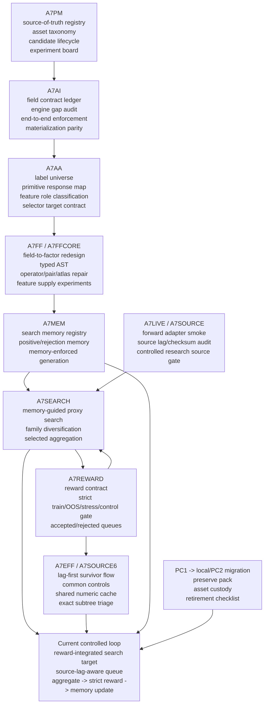

# Evolution Map

Generated: 2026-07-10

## Purpose

This file explains the project evolution separately from the current architecture. It answers why the repository contains many A7* stages without implying all of them are live system components.

## Phase-Level Evolution



## Evolution Summary

| Track | What it contributed | Current interpretation |
|---|---|---|
| A7PM | Source-of-truth registry, asset taxonomy, lifecycle, experiment board | Governance foundation remains current |
| A7AI | Field contract enforcement and evaluator/materialization parity | Enforcement foundation remains current |
| A7AA | Label/response adequacy and selector target contract | Response/label governance remains current |
| A7FF | Field-to-factor exploration and many feature-generation repairs | Historical feature-supply evidence plus selected current contracts |
| A7FFCORE | Typed AST, compiler/search readiness, replay and objective repairs | Important architecture evidence; not every stage is current |
| A7MEM | Search memory and generator memory enforcement | Active part of search loop |
| A7REWARD | Strict reward gates and rejection reasons | Active gate between proxy outputs and accepted candidates |
| A7EFF/A7SOURCE6 | Survivor-only reward flow, deterministic controls, shared numeric cache, registry-backed semantic canonicalization, exact signal representatives, alias restoration, SafeDiv and subtree/marginal triage | Active execution and information-source approval contract |
| A7SEARCH | Large proxy searches and selected aggregates | Active large-search family |
| A7SOURCE/A7LIVE | Source-lag, checksum, forward adapter, controlled research readiness | Active source/PIT control layer |
| PC migration | PC1 old-company asset preservation and PC2 bootstrap | Effective mother/contract and source-provenance custody closed; final wipe checklist remains |

## Supersession Rule

An old report is not live just because it exists. A stage is current only when the current source-of-truth registry or planning state marks it as current or as an active dependency.

Old artifacts can be:

```text
current_valid
valid_or_historical_record
engineering_pass_signal_hold
superseded_diagnostic
not_authorized
hold
```

These statuses matter more than raw graph reachability.

## Current Critical Loop

```text
PC1 final inventory/wipe checklist (operations-only gate)

reward-integrated/source-lag-aware queue construction
-> registry-backed semantic canonicalization
-> sharded cheap evaluation only as a diagnostic layer
-> lag-first survivor filter
-> exact portfolio-signal representative selection
-> shared numeric cache and deterministic controls
-> strict reward gate
-> alias restoration / representative-only memory feedback
-> exact AST subtree / SafeDiv / portfolio-marginal triage
-> A7MEM update
-> next queue construction
```

## Current PC2 Validation State

The first PC1-wide strict-reward pass rejected every row because required source-lag evidence was not attached:

```text
A7REWARD1 over PC1-wide selected queue:
  queue_rows: 48
  reward_rows: 188
  accepted_for_next_search_rows: 0
  valid_reward_rows: 0
  hard_reject_rows: 188
  source_lag_policy_reject_rows: 188
  decision: HOLD_A7REWARD1_REWARD_MODEL_OR_QUEUE_FAILED
```

After the queue was re-run through the source-lag gate on PC2, strict reward completed with:

```text
queue_rows: 48
source_lag_required_rows: 41
source_lag_pass_rows: 13
reward_rows: 188
accepted_rows: 8
accepted_unique_blueprints: 8
hard_reject_rows: 180
eval_error_rows: 0
decision: PASS_A7V3S0_REWARD_SHARDED_AGGREGATE_READY
```

This supersedes the interpretation that the earlier zero-accepted result proved no edge. It does not make the eight survivors independent alphas.

The corrected A7SOURCE6 exact-subtree flow then completed with:

```text
focused_queue_rows: 53
source_lag_survivors: 33
strict_reward_rows: 132
accepted_rows: 16
eval_error_rows: 0

source decisions:
  incremental_interaction: 1
  oos_equivalent_nonunique: 5
  canonical_repass_failure: 1
  portfolio_marginal_review: 1
```

The execution path was also repaired and performance-validated. Source-lag rejects are removed before strict reward, shuffle controls use common random numbers, the panel is decoded once into a manifest-backed shared memmap cache, and repeated rank/IC work is reused or vectorized. The same 132 reward rows and exact 16-row accepted set completed in `136.688s` versus about `1,735s` for the baseline, with exact gate/reject decisions and machine-precision metric differences.

The semantic compiler now propagates contracted field value domains through the active AST. Constant-conditioner collapse is resampled/rejected, while nonconstant redundant wrappers are canonicalized so valid inner mechanisms survive. On the frozen 53-row pack, `8` rows were rewritten, only `3` standalone constants were removed, and the exact prior `16 / 16` accepted set was preserved.

After source lag, `33` survivors compressed to `18` exact portfolio-signal representatives before reward, avoiding `15` (`45.5%`) expensive evaluations. Alias restoration reproduced all `132` reward rows and all prior metrics. Reward-level representative triage contains `6` rows, while final A7SOURCE6 incremental search-memory feedback contains only `1`. The retained SafeDiv candidate is explicitly held for marginal review because its signal p99/median is `462.11` and its top 1% absolute signal mass share is `74.39%`.

## PC1 Custody Milestone

The effective data gap and its source lineage are now hash-closed locally and on PC2:

```text
effective mother/contract pack:
  files: 11518
  bytes: 3516599296
  sha256: A2ACA1BAED52933226B8A6F27AA02DED1276AAA618917952F2464F8108AA024D

source-provenance pack:
  files: 314300
  bytes: 730343424
  sha256: FEDC028A25E59F498FE1EFAC4411CB96F0922FEA987E3262CC1FB226D439C487
```

The provenance pack includes checksums, manifests, coverage, acquisition/conversion scripts, source probes, API traces, lineage/contracts/schema/audits, and matching process evidence. PC1 may proceed to a final inventory/wipe checklist, but this milestone does not itself authorize deletion.

## Explicit Non-Goals

The evolution map does not authorize:

```text
alpha proof
shadow book
paper/live trading
production portfolio construction
```
