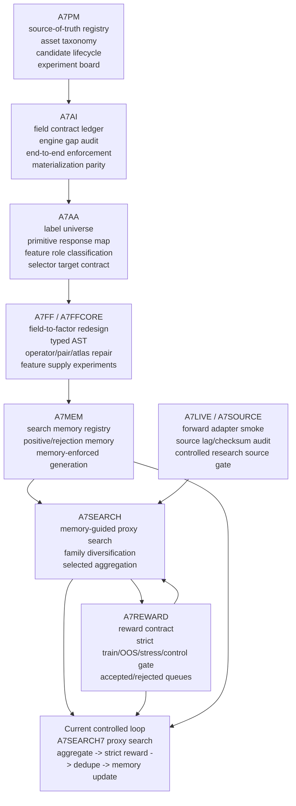

# Evolution Map

Generated: 2026-07-05

## Purpose

This file explains the project evolution separately from the current architecture. It answers why the repository contains many A7* stages without implying all of them are live system components.

## Phase-Level Evolution



## Evolution Summary

| Track | What it contributed | Current interpretation |
|---|---|---|
| A7PM | Source-of-truth registry, asset taxonomy, lifecycle, experiment board | Governance foundation remains current |
| A7AI | Field contract enforcement and evaluator/materialization parity | Enforcement foundation remains current |
| A7AA | Label/response adequacy and selector target contract | Response/label governance remains current |
| A7FF | Field-to-factor exploration and many feature-generation repairs | Historical feature-supply evidence plus selected current contracts |
| A7FFCORE | Typed AST, compiler/search readiness, replay and objective repairs | Important architecture evidence; not every stage is current |
| A7MEM | Search memory and generator memory enforcement | Active part of search loop |
| A7REWARD | Strict reward gates and rejection reasons | Active gate between proxy outputs and accepted candidates |
| A7SEARCH | Large proxy searches and selected aggregates | Active large-search family |
| A7SOURCE/A7LIVE | Source-lag, checksum, forward adapter, controlled research readiness | Active source/PIT control layer |

## Supersession Rule

An old report is not live just because it exists. A stage is current only when the current source-of-truth registry or planning state marks it as current or as an active dependency.

Old artifacts can be:

```text
current_valid
valid_or_historical_record
engineering_pass_signal_hold
superseded_diagnostic
not_authorized
hold
```

These statuses matter more than raw graph reachability.

## Current Critical Loop

```text
A7SEARCH7 proxy search
-> selected aggregate
-> strict reward
-> dedupe / information-source triage
-> A7MEM update
-> next queue construction
```

## Explicit Non-Goals

The evolution map does not authorize:

```text
alpha proof
shadow book
paper/live trading
production portfolio construction
```
