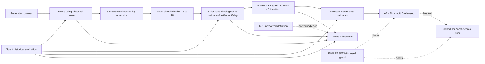

# CRYPTO A7EVALRESET-0 Collapse Forensics

Generated: `2026-07-11T05:09:26Z`

## Decision

`PHASE_A_GOVERNANCE_ACCEPTED`

`SEARCH_COLLAPSE_SOURCE_PARTIALLY_IDENTIFIED`

`HOLD_RESEARCH`

This is historical forensic evidence only. It authorizes neither alpha proof nor new search, forward reads, positive memory, shadow, paper, or live use.

Exact-identity admission and strict reward are confirmed contraction points. Without signal, activation, PnL/regime, and economic-hypothesis registries, this report does not identify the first collapse of independent economic information.

## Feedback Graph

## OOS Burn Ledger

| epoch_id | selected_start_utc | selected_end_utc | current_classification | burn_reason | status |
|---|---|---|---|---|---|
| validation_2025H1 | 2025-06-01T00:00:00Z | 2025-06-30T23:00:00Z | SPENT_HISTORICAL_EVALUATION | proxy/reward/admission/memory/scheduler/human decisions | BURNED_AND_SEALED_FROM_FEEDBACK |
| test_2025H2 | 2025-12-02T00:00:00Z | 2025-12-31T23:00:00Z | SPENT_HISTORICAL_EVALUATION | proxy/reward/admission/memory/scheduler/human decisions | BURNED_AND_SEALED_FROM_FEEDBACK |
| recent_oos_2026JanApr | 2026-04-01T00:00:00Z | 2026-04-30T23:00:00Z | SPENT_HISTORICAL_EVALUATION | proxy/reward/admission/memory/scheduler/human decisions | BURNED_AND_SEALED_FROM_FEEDBACK |
| known_may2026_stress | 2026-05-01T00:00:00Z | 2026-05-26T00:00:00Z | SPENT_HISTORICAL_EVALUATION | proxy/reward/admission/memory/scheduler plus repeated stress veto and human decisions | BURNED_AND_SEALED_FROM_FEEDBACK |

## Accepted Compression

| level | input_rows | unique_count | retained_percent | duplicate_compression_percent | status |
|---|---|---|---|---|---|
| accepted_row | 16 | 16 | 100.00 | 0.00 | ESTABLISHED |
| canonical_expression | 16 | 6 | 37.50 | 62.50 | ESTABLISHED |
| exact_signal_identity | 16 | 6 | 37.50 | 62.50 | ESTABLISHED |
| signal_cluster | 16 |  |  |  | NOT_ESTABLISHED |
| pnl_regime_cluster | 16 |  |  |  | NOT_ESTABLISHED |
| economic_hypothesis | 16 |  |  |  | NOT_ESTABLISHED |

Exact identity group sizes: `[9, 3, 1, 1, 1, 1]`.

Signal cluster, PnL/regime cluster, and economic hypothesis counts are intentionally unresolved rather than inferred from accepted-family labels.

## Collapse Localization

| stage | input_count | output_count | retained_percent | finding |
|---|---|---|---|---|
| generation | unknown | unknown |  | UNLOCATED_MISSING_END_TO_END_PROVENANCE |
| proxy | unknown | 53 |  | UNLOCATED_EXTERNAL_HANDOFF_AND_SPENT_OOS_FEEDBACK |
| semantic_admission | 53 | 50 | 94.34 | MINOR_SEMANTIC_REJECTION |
| source_lag_admission | 50 | 33 | 66.00 | MATERIAL_SOURCE_LAG_ATTRITION |
| exact_identity_admission | 33 | 18 | 54.55 | PRIMARY_ALIAS_COLLAPSE |
| strict_reward | 18 | 6 | 33.33 | MATERIAL_REWARD_ATTRITION_WITH_SPENT_OOS_DEPENDENCY |
| memory | 1 | 0 | 0.00 | FULL_CREDIT_BLOCK_AT_FIELD_APPROVAL |
| scheduler | historical accepted/proxy rows | adaptive budgets and queues |  | INVALID_FEEDBACK_PATH_SPENT_OOS_CONTAMINATION |

## Risk Closure Audit

| risk | status | finding | required_closure |
|---|---|---|---|
| funding_event_detection | UNRESOLVED_HOLD | Historical event capture was approximately 66%; current release has no reproducible payment-event repair proof. | Independent payment timestamp/event coverage test using predeclared event truth, without reading new forward performance. |
| future_wrong_lag | FAIL_MISSING_CONTROL | Strict reward declares five controls and no future wrong-lag variant. | Add a fail-closed future wrong-lag negative control and a regression fixture before reward can be reused. |
| source_lag | PARTIAL_HOLD | 50 semantically valid candidates became 33 source-lag passes and 17 rejects; source evidence paths are not locally reproducible. | Restore immutable source evidence and verify field-specific publication lag and event timestamps. |
| field_approval | FAIL_COVERAGE_GAP | 6/10 active fields lack A7INPUT0 approval: account_position_divergence;open_interest_value_last;open_interest_value_mean;top_global_account_divergence;top_long_short_account_ratio_last;top_long_short_position_ratio_last. Final evidence uses: account_position_divergence;open_interest_value_last. | Approve economic/input roles independently of accepted-family and OOS ranking. |
| identity_alias | CONFIRMED_COLLAPSE | 33 source-lag survivors collapse to 18 exact signals; 16 accepted rows collapse to 6 exact signals. | Keep exact identity before reward and add independent signal/PnL/economic registries. |
| BZ | UNRESOLVED_NODE | No verified BZ implementation, contract, or runtime is present in the release evidence. | Provide an authoritative BZ definition and provenance before adding graph edges or feedback semantics. |

## Release Integrity

| artifact | status | actual_sha256 |
|---|---|---|
| a7eff2_accepted_train_validation_oos_log.csv | PASS | 65CB07431725FA1CAFF91990BA67305AADAD82616ABA58B2D9010217A5D3946D |
| a7eff2_active_field_registry.csv | PASS | EC6B910B774D3AABDF5329A5752AA3A175DCAA9BD08D35D6FEEE23FFF84AFC63 |
| a7eff2_train_validation_oos_split_log.csv | PASS | A8E36D2788D29525C9982B21BA5A616F62E88417A447A915011E682F1B25AEA1 |

The release outputs match their embedded hashes. The source arrays and numeric-cache manifest referenced under the old `G:\Chengbo\runtime` path are absent locally, so numeric replay is not established by this audit.

## Sealed Epoch Rule

Unknown epochs default to `SEALED_FORWARD`. Spent and sealed metrics may be read only for audit/reproduction and may not enter candidate ranking, admission, memory credit, priors, scheduler budgets, or human promotion packets.
