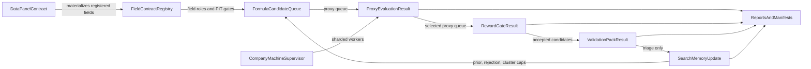

# CRYPTO SYSTEM ARCHITECTURE BLUEPRINT 20260630

Generated: `2026-06-30T12:54:47Z`

## Decision

`PASS_SYSTEM_ARCHITECTURE_BLUEPRINT_BUILT`

## Target Verified-Core Flow

## Nodes

| id | label | type |
| --- | --- | --- |
| data | DataPanelContract | contract |
| fields | FieldContractRegistry | contract |
| formula | FormulaCandidateQueue | queue |
| proxy | ProxyEvaluationResult | evaluation |
| reward | RewardGateResult | validation |
| validation | ValidationPackResult | validation |
| memory | SearchMemoryUpdate | governance |
| orchestration | CompanyMachineSupervisor | runtime |
| reports | ReportsAndManifests | source_of_truth |

## Edges

| from | to | relation |
| --- | --- | --- |
| data | fields | materializes_registered_fields |
| fields | formula | authorizes_field_roles |
| memory | formula | enforces_prior_and_caps |
| formula | proxy | evaluated_by_proxy |
| proxy | reward | selected_queue_if_proxy_pass |
| reward | validation | accepted_queue_requires_ablation |
| validation | memory | triage_updates_prior |
| orchestration | proxy | runs_sharded_workers |
| proxy | reports | writes_manifest |
| reward | reports | writes_manifest |
| validation | reports | writes_manifest |
| memory | reports | writes_registry |
